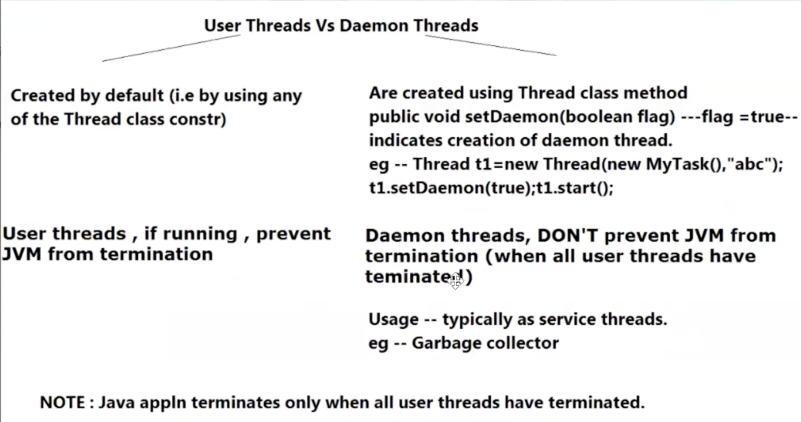
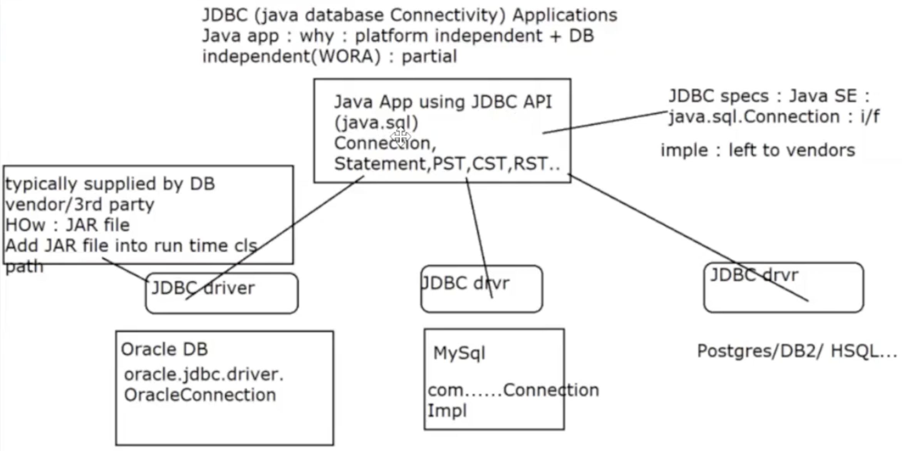

# User vs Daemon thread


```java
package daemon_thrds;
public class RunnableTask implements Runnable{
    @Override
    public void run(){
        System.out.println(Thread.currentThread().getName + " started");
        try{
            for(int i = 0; i < 10; i++){
                if(Thread.currentThread().getName().equals("two")){
                    System.out.println("Enter Data");
                    int data = System.in.read();
                }
                System.out.println(Thread.currentThread().getName() + " exec # " + i);
                Thread.sleep(500);
            }
        } catch(Exception e){
            System.out.println("err in thrd " + Thread.currentThread().getName() + " exc " + e);
        }
    }
}
```

```java
package daemon_thrds;
public class Tester{
    public static void main(String[] args) throws InterruptedException{
        System.out.println("main thrd's details" + Thread.currentThread());

    }
}
```

Web_programming pre-requisites
DB related instructions
jdbc-whiteboard
sequnce
jdbc drivers


JDBC : Java DB Connectivity
What is it? : API -- java.sql -- to allow prog -- to connect to DB, CRUD, close connection
why? : allows prog: platform independence DB apps + DB vendor independence.
JDBC allows only partial DB independence.

