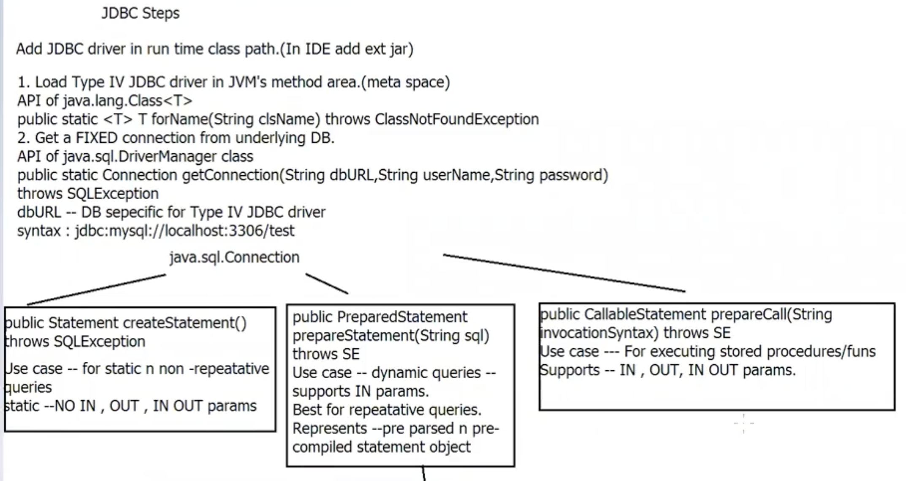
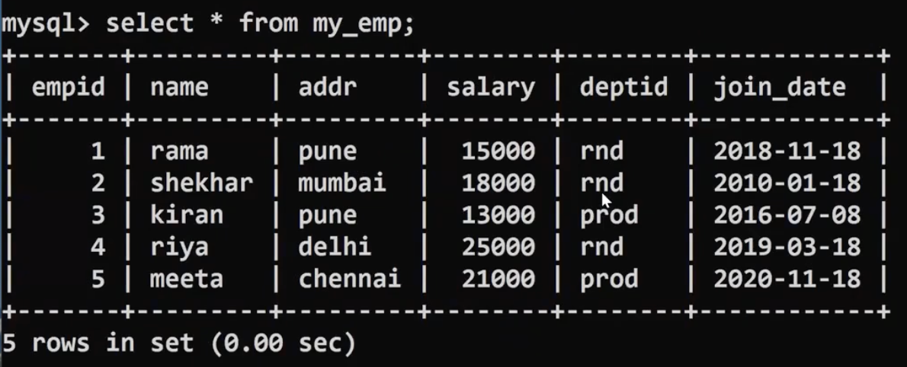

# User vs Daemon thread


```java
package daemon_thrds;
public class RunnableTask implements Runnable{
    @Override
    public void run(){
        System.out.println(Thread.currentThread().getName + " started");
        try{
            for(int i = 0; i < 10; i++){
                if(Thread.currentThread().getName().equals("two")){
                    System.out.println("Enter Data");
                    int data = System.in.read();
                }
                System.out.println(Thread.currentThread().getName() + " exec # " + i);
                Thread.sleep(500);
            }
        } catch(Exception e){
            System.out.println("err in thrd " + Thread.currentThread().getName() + " exc " + e);
        }
    }
}
```

```java
package daemon_thrds;
public class Tester{
    public static void main(String[] args) throws InterruptedException{
        System.out.println("main thrd's details" + Thread.currentThread());

    }
}
```

Web_programming pre-requisites
DB related instructions
jdbc-whiteboard
sequnce
jdbc drivers


JDBC : Java DB Connectivity
What is it? : API -- java.sql -- to allow prog -- to connect to DB, CRUD, close connection
why? : allows prog: platform independence DB apps + DB vendor independence.
JDBC allows only partial DB independence.

JDBC -> Java to db language and DB lang to Java translator
JDBC Driver is DB specific

```java
package tester;
public class TestDBConnection{
    public static void main(String[] args){
        try{
        //Class.forName("com.mysql.cj.jdbc.Driver"); --> Only needed in older versions of jdbc-> loading connector
        String url = "jdbc:mysql://localhost:3306/dac22?useSSL=false&allowPublicKeyRetrieval=true";
        //API of java.sql.DriverManager class
        //public static Connection getConnection(String url, String userName, String pwd) throws SQLException
        try(Connection cn=DriverManager.getConnection(url,"root","root")){
            System.out.println("Connected to DB "+cn);
        }
    } catch(Exception e){
        e.printStackTrace();
    }
}
}
```
DriverManager class-> getConnection method
ConnectionImpl.class

# SQL commands

createStatement()

```java
package utils;
import java.sql.*;
public class DBUtils{
    //add a static method to return DB conncection instance
    //modify the code below, to ensure SINGLETON instance of the DB connection
    //(not a scalable solution, will be replaced by connection pool, from hibernate onwards)
    private static Connection cn;
    public static Connection openConnection() throws SQLException{
        if(cn==null){
        String url = "jdbc:mysql://localhost:3306/dac22?useSSL=false&allowPublicKeyRetrieval=true";
        //return DriverManager.getConnection(url,"root","root");
        cn = DriverManager.getConnection(url,"root","root");
        }
        return cn;
    }
}
```

```java
package tester;
import static utils.DBUtils.openConnection;
import java.sql.*;
public class TestStatement{
    public static void main(String[] args){
        try(Connection conn = openConnection();
            //create empty statement object, to hold query
            Statement st = conn.createStatement();
            ResultSet rst = st.executeQuery("select * from my_emp");)
        {
            while(rst.next())
                System.out.printf("Emp Id %d Name %s Address %s Salary %.1f DeptId %s Join Date %s %n", rst.getInt(1),rst.getString(2),rst.getString(3),rst.getDouble(4),rst.getString(5),rst.getDate(6));
        }//rst.close,st.close,cn.close-->autoclosability
        catch(Exception e){
            e.printStackTrace();
        }
    }
}
```

```java
package tester;
import java.util.Scanner;
import java.sql.*;
import static utils.DBUtils.openConnection;
public class TestPreparedStatement{
    public static void main(String[] args){
        String sql="select * from my_emp where deptid=? and join_date > ? order by salary";
        try(Scanner sc = new Scanner(System.in);
        //establish db connection
            Connection cn = openConnection();
            //create PST
            PreparedStatement pst = cn.preparedStatement(sql);
            ){
                System.out.println("Enter deptid n date");
                String deptId = sc.next();
                Date joinDate = Date.valueOf(sc.next());
                //set IN params
                pst.setString(1,deptId);
                pst.setDate(2,joinDate);
                //execute query
                try(ResultSet rst = pst.executeQuery()){
                    while(rst.next())
                        System.out.printf("Emp Id %d Name %s Address %s Salary %.1f DeptId %s Join Date %s %n", rst.getInt(1),rst.getString(2),rst.getString(3),rst.getDouble(4),rst.getString(5),rst.getDate(6));
                }//rst.close
            }//pst.close, cn.close
            catch(Exception e){
                e.printStackTrace();
            }
    }
}
```
# Day 1.2
Add Synchronized keyword again in both of the methods in JointAccount class n check if .. is removed
(refer to sequence n readme synchronization n synchro diagrams)

3. import day 21.3, to understand synchronized blocks
4. import day 21.4, for more practice on synchronization
5. Optional assignment:
refer to day 21-data\assignment
copy the package "thread_unsafe_collection", in your eclipse project
Run "ThreadUnsafeCollections.java", multiple times.
Do you see any problem?
You will see ConcurrentModificationException
Fix it.

Day 22
1.Complete earlier work
2.import day 22.1 in your core java workspace n revise, ITC n daemon threads