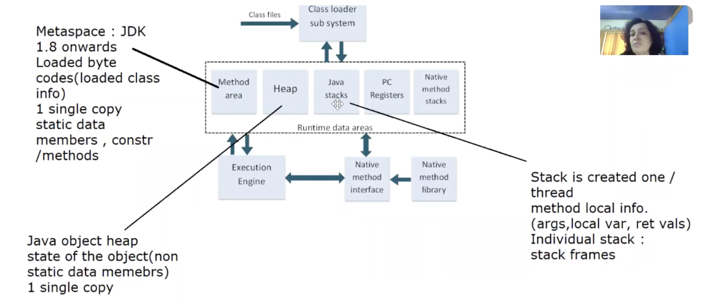

# Why Java?
* Platform Independent — WORA, because .class files can run on any machine as JVM will platform specific
* **Simple** because doesn't support complex features in cpp like multiple inheritance, operator overloading
* **Robust** because it doesn't allow pointer arithmetic (Robust)
* Secure - When the JVM loads the class, it performs verification as part of class loading automatically.
* Object-Oriented
Though java is not 100% Object oriented as it allows primitive data types as well.
**OOP → Encapsulation + Inheritance + Polymorphism + Abstraction**
```java
class Account {
    private double balance;       // Encapsulation

    void deposit(double amount) { // Abstraction
        balance += amount;
    }
}

class SavingsAccount extends Account { } // Inheritance
```

```java
Account account = new SavingsAccount();   // Polymorphism
```
* Automatic Memory Management

```java
Account account = new Account();

account = null;    // object becomes eligible for GC
```

**JVM → Garbage Collector → automatically manages unused objects** -> Unlike CPP where we need to call destructor everytime to free the memory

* Multithreaded - Java provides built-in support for concurrent execution.

```java
Thread thread = new Thread(() -> {
    System.out.println("Running in another thread");
});

thread.start();
```

* Functional Programming Support
After Java 8:
Java supports functional-style programming using **lambda expressions, functional interfaces, method references, and Streams**.

```java
List<Integer> amounts = List.of(1000, 2000, 5000);

amounts.stream()
       .filter(amount -> amount > 1500)
       .forEach(System.out::println);
```

Here:

```text
amount -> amount > 1500   → Lambda expression
filter()                  → Functional operation
stream()                  → Stream API
System.out::println       → Method reference
```

It allows Java to express **what should be done** more concisely, especially when processing collections.

* Rich I/O & Networking - Java provides APIs for files, streams, TCP/IP, UDP/IP, URLs, etc.

I/O:
```java
Files.readString(Path.of("data.txt"));
```
Networking:
```java
Socket socket = new Socket("example.com", 80);
```


# Java Security features

You should know it at **two levels**:

### Level 1 — Core Java interview

```text
Java Security
│
├── Strong type checking
├── Encapsulation + access modifiers
├── No explicit pointer arithmetic
├── Automatic memory management
├── Bytecode verification
├── Class Loader
└── Security APIs
    ├── Cryptography
    ├── Certificates
    └── TLS/SSL
```
### Level 2 — Backend/Senior interview: learn these separately
```text
Security & Cryptography
├── Hashing
├── Encryption vs hashing
├── Symmetric encryption
├── Asymmetric encryption
├── Digital signatures
├── Public/private keys
├── Certificates
├── TLS/HTTPS
├── KeyStore
├── Authentication
└── Authorization
```

Why?

Because at your target level, you may be asked things like:

> “How does HTTPS work?”

> “What's the difference between hashing and encryption?”

> “How does a server verify a client's identity?”

> “What is a digital signature?”

> “Where would you store private keys?”

Those are **backend security concepts**, not merely “Java syntax.”

```text
                    JAVA SECURITY
                         │
        ┌────────────────┼────────────────┐
        │                │                │
   LANGUAGE LEVEL     JVM LEVEL       SECURITY APIs
        │                │                │
        ▼                ▼                ▼
 Strong typing      Class Loader      Cryptography
 Encapsulation      Bytecode         Certificates
 No pointers        verification     KeyStore
 Memory safety                       Digital signatures
                                      TLS/SSL
```

In short -

> "Java provides security at multiple levels. At the language level, strong type checking, encapsulation, access control, and the absence of explicit pointer arithmetic improve memory and type safety. At the JVM level, class loading and bytecode verification help ensure that loaded classes follow JVM safety constraints. Java also provides security APIs for cryptography, digital signatures, certificates, and TLS-based secure communication."

# Java Naming Conventions

* **Class/Interface:** `PascalCase` 
* **Method/Variable:** `camelCase` 
* **Constant:** `UPPER_SNAKE_CASE` 
* **Package:** `lowercase` 
* **Enum:** `PascalCase` (constants `UPPER_SNAKE_CASE`)
Definitions -
* **PascalCase** → Each word starts with a capital letter: `BankAccount`
* **camelCase** → First word lowercase, subsequent words capitalized: `accountBalance`
* **UPPER_SNAKE_CASE** → Words uppercase and separated by `_`: `MAX_AMOUNT`
* **lowercase** → All letters lowercase, typically used for packages: `com.bank.account`
* **Enum constants** → Usually `UPPER_SNAKE_CASE`: `PENDING_APPROVAL`


# Identifiers
An **identifier** is the **name given by the programmer to identify a program element**.
```java
class BankAccount {          // BankAccount → identifier
    private double balance;  // balance → identifier

    void deposit(double amount) {  // deposit, amount → identifiers
        balance += amount;
    }
}
```
What can be an identifier?
```text
Class        → BankAccount
Variable     → balance
Method       → deposit
Object       → account
Parameter    → amount
Package      → banking
```


### Rules for Java Identifiers

1. **Can contain letters, digits, `_`, and `$`**

   ```java
   accountBalance
   account2
   _balance
   $amount
   ```

2. **Cannot start with a digit**

   ```java
   2account   // ❌
   account2   // ✅
   ```

3. **Cannot contain spaces**

   ```java
   account balance   // ❌
   accountBalance    // ✅
   ```

4. **Cannot use special characters** like `-`, `@`, `#`, `%`

   ```java
   account-balance   // ❌
   account_balance   // ✅
   ```

5. **Cannot be a Java keyword**

   ```java
   int class;     // ❌
   int public;    // ❌
   int account;   // ✅
   ```

6. **Java identifiers are case-sensitive**

   ```java
   int balance;
   int Balance;   // Different identifier
   ```

7. **Can use Unicode characters**, because Java identifiers support Unicode.

   ```java
   int café = 10;   // technically valid
   ```

   However, standard Java naming conventions should be preferred for readability.


# Access Specifiers/Modifier in Java

In Java, **access specifiers (access modifiers)** control **where a class, method, variable, or constructor can be accessed from**.

Java has **4 access levels**:

```text
             Same Class   Same Package   Subclass   Other Package
public           ✅            ✅            ✅            ✅
protected        ✅            ✅            ✅            ⚠️
default          ✅            ✅            ❌            ❌
private          ✅            ❌            ❌            ❌
```
* methods? private, default, protected, public
* which are applicable to top level classes? -> default, public
* `private` and `protected` are allowed for nested classes.

## `protected` — Same package + subclasses

```java
class Account {

    protected double balance;
}
```

### Same package

```java
class BankService {

    void update(Account account) {
        account.balance;  // ✅
    }
}
```

### Different package + subclass

```java
class SavingsAccount extends Account {

    void showBalance() {
        System.out.println(balance); // ✅
    }
}
```

### Different package + non-subclass

```java
class CustomerService {

    void update(Account account) {
        account.balance;  // ❌
    }
}
```

### Important `protected` nuance

Across packages, `protected` access is available through **inheritance**, not simply because you have an object of the superclass.


### The easiest way to remember

Think of access as **increasing visibility**:
```text
private    → My room
default    → My building
protected  → Family + building
public     → Anyone
```

---

# Basic Definitions and Concepts
* API -> Application Programmer Interface
* Package -> collection of functionally similar classes
* java.lang package by default available always inherently
* import -> to avail
* syntax of import outside of class always
* Java follows single root inherentance hierarchy-> all classes implicitly extend **Object class**
* System-> static class having fields in, out
* out has type PrintStream(from java.io package) which is another class shows -> HAS-A relationship
* src -> java files
* bin -> .class files
* to generate .class files in bin folder use command -> javac -d ..\bin File.java
* ```cd ..\bin``` (go to bin folder to run the class file) -> ```java File``` (case - sensitive file name)

* Java is both compiled and interpreted language
* it is platform independent because JVM is platform specific - .class files will be platform independent -> JVM creates platform specific bytecodes
* JDK = Java dev tools(javac, java, javap, jar,jar signer, appletviewer) + JRE( Java API libs ) + JVM (containing 1. class loader, 2. Interpreter, 3. JIT compiler, 4. HotSpot profiler)
```text
                     ┌──────────────────────────────────────┐
                     │     JDK (Java Development Kit)       │
                     └──────────────────┬───────────────────┘
                                        │
         ┌──────────────────────────────┴──────────────────────────────┐
         │                                                             │
┌────────┴──────────────┐                                   ┌──────────┴────────────┐
│    Java Dev Tools     │                                   │          JRE          │
│                       │                                   │(Java Runtime Environ.)│
├─ javac (Compiler)     │                                   └──────────┬────────────┘
├─ java (Launcher)      │                                              │
├─ javap (Disassembler) │                                              ├─ Java API Libs
├─ jar (Archiver)       │                                              │
├─ jar signer           │                                              └─ JVM (Java Virtual Machine)
└─ appletviewer         │                                                   ├─ 1. Class Loader
                        │                                                   ├─ 2. Interpreter
                        │                                                   ├─ 3. JIT Compiler
                        │                                                   └─ 4. HotSpot Profiler
                        └───────────────────────┬────────────────────────────────┘
                                                │
                                                ▼
                                     (Executes the Bytecode)

```
* Java src code -->(Java compiler) --> ByteCode -->(JIT compiler) --> Native code 
* class files -> class loader -><- Runtime data areas(Method area + Heap + Java stacks + PC registers + Native method stacks) -><- Execution Engine -><- Native method interface -> native method library

* Java Hot Spot -> adaptive learning like AI
* main function expects String, we'll parse string to num to calculate the sum and avoid concatenation
CoreJava/src/java01/Sum.java
```
package java01;

public class Sum {
    public static void main(String[] ss){
        int num1 = Integer.parseInt(ss[0]);
        int num2 = Integer.parseInt(ss[1]);
        System.out.println("Sum="+(num1 + num2));
    }
}
```
```
piyushalomte@Piyushas-MacBook-Pro ~ % cd Documents
piyushalomte@Piyushas-MacBook-Pro Documents % cd Learn-Java
piyushalomte@Piyushas-MacBook-Pro Learn-Java % code . 
piyushalomte@Piyushas-MacBook-Pro Learn-Java % mkdir -p CoreJava/bin/java01
piyushalomte@Piyushas-MacBook-Pro Learn-Java % javac -d CoreJava/bin CoreJava/src/java01/Sum.java
piyushalomte@Piyushas-MacBook-Pro Learn-Java % java -cp CoreJava/bin java01.Sum 10 20
Sum=30
```
the flow is 
```text
Sum.java
   │
   │ javac
   ▼
Sum.class
   │
   │ java + arguments
   ▼
output: 30
```
# Static Method ->
In Java, a **static method belongs to the class, not to an object**. So there are several ways you may see it called.

### 1. Using the class name — ✅ Recommended

```java
class Calculator {
    static int add(int a, int b) {
        return a + b;
    }
}

public class Main {
    public static void main(String[] args) {
        int result = Calculator.add(10, 20);
        System.out.println(result);
    }
}
```

**Interview answer:**

> A static method should normally be called using the class name because it belongs to the class rather than an instance.

---

### 2. Directly by method name from the same class

```java
class Calculator {

    static void greet() {
        System.out.println("Hello");
    }

    public static void main(String[] args) {
        greet();
    }
}
```

This works because `main()` and `greet()` are both static methods of the same class.

You can also write:

```java
Calculator.greet();
```

Both work.

---

### 3. Using an object — ⚠️ Possible, but not recommended

```java
class Calculator {
    static void greet() {
        System.out.println("Hello");
    }
}

public class Main {
    public static void main(String[] args) {
        Calculator c = new Calculator();

        c.greet();   // Works, but NOT recommended
    }
}
```

Java allows this, but the compiler treats the call as a **static method invocation based on the type**, not as an instance-method call.

Conceptually, prefer:

```java
Calculator.greet();
```

instead of:

```java
c.greet();
```

---

### 4. Through inheritance

Static methods can be inherited by a subclass.

```java
class Parent {
    static void show() {
        System.out.println("Parent");
    }
}

class Child extends Parent {
}

public class Main {
    public static void main(String[] args) {
        Child.show();   // Works
    }
}
```

But remember: **static methods are hidden, not overridden.**


### ⭐ One important point

This is why you often see:

```java
public static void main(String[] args)
```

The JVM can invoke `main()` **without creating an object**:

```text
JVM
 ↓
Main.main(args)
```

because `main()` is static.

> **The JVM invokes the `main` method as the application's entry point using the class name and the required `String[]` signature. Inside a static context, static methods can be invoked directly by method name if they are accessible.**

And one correction to my previous answer: **“same class” is a simplification.** A static method can also be called by its simple name when it is inherited or statically imported and is accessible.


# Java Data Types
Java is **statically typed**, so a variable's type is known at compile time.

```text
Java Data Types
│
├── Primitive
│   ├── byte
│   ├── short
│   ├── int
│   ├── long
│   ├── float
│   ├── double
│   ├── char
│   └── boolean
│
└── Reference
    ├── Class/Object
    ├── String
    ├── Array
    ├── Interface
    ├── Enum
    └── Record
```

## 1. Primitive Types

| Type      |                         Size | Typical use                         |
| --------- | ---------------------------: | ----------------------------------- |
| `byte`    |                        8-bit | Small integers                      |
| `short`   |                       16-bit | Rare in application code            |
| `int`     |                       32-bit | Default integer choice              |
| `long`    |                       64-bit | Large integers / IDs                |
| `float`   |                       32-bit | Lower-precision decimal             |
| `double`  |                       64-bit | General floating-point calculations |
| `char`    |                       16-bit | Single UTF-16 code unit             |
| `boolean` | JVM-dependent representation | `true` / `false`                    |

### Practical choices

```text
Normal integer       → int
Large integer / ID   → long
Floating point       → double
Money                → BigDecimal
Boolean              → boolean
Text                 → String
Single character     → char
```

**Do not use `double` for financial amounts. Use `BigDecimal`.**

```java
BigDecimal amount = new BigDecimal("100.50");
```

Avoid:

```java
new BigDecimal(100.50); // may capture binary floating-point approximation
```

## 2. Reference Types

Reference variables refer to objects.

```java
BankAccount account = new BankAccount();
String name = "Piyusha";
int[] amounts = {100, 200, 500};
```

Common reference types:

* Classes
* Objects
* Arrays
* Interfaces
* Strings
* Enums
* Records

Example:

```java
List<String> names = new ArrayList<>();
```

`List` is the reference type/interface and `ArrayList` is the implementation.

## 3. Primitive vs Reference

| Primitive        | Reference                                |
| ---------------- | ---------------------------------------- |
| 8 built-in types | Classes, arrays, interfaces, enums, etc. |
| Stores a value   | Holds a reference to an object           |
| Cannot be `null` | Can be `null`                            |
| `int`            | `Integer`                                |
| `double`         | `Double`                                 |
| `boolean`        | `Boolean`                                |

## 4. Wrapper Classes

```text
byte      → Byte
short     → Short
int       → Integer
long      → Long
float     → Float
double    → Double
char      → Character
boolean   → Boolean
```

Collections use wrapper types because generics work with reference types:

```java
List<Integer> numbers = new ArrayList<>();
```

Not:

```java
List<int> numbers; // invalid
```

### Autoboxing / Unboxing

```java
Integer x = 100; // autoboxing
int y = x;       // unboxing
```

Autoboxing and generics were introduced in **Java 5**.

## 5. `null`

Primitives cannot be `null`:

```java
int age = null;       // invalid
```

Reference variables can:

```java
Integer age = null;   // valid
String name = null;   // valid
```

`null` means a reference currently refers to no object.

## 6. Default Values

Instance/static fields receive default values:

```text
byte/short/int   → 0
long             → 0L
float            → 0.0f
double           → 0.0d
char             → '\u0000'
boolean          → false
reference        → null
```

Local variables do **not** receive automatic default values.

```java
void test() {
    int count;
    System.out.println(count); // compile-time error
}
```

## 7. Type Conversion

### Widening — automatic

```java
int x = 100;
long y = x;
```

### Narrowing — explicit cast

```java
long x = 100;
int y = (int) x;
```

Narrowing can lose information:

```java
double amount = 100.99;
int value = (int) amount;

// value = 100
```
> popular interview point -> long -> float is considered automatic type of conversion(widening) 
> Rule -> src and dest must be compatible, dest should store larger magnitude values than src data type.
**FLOAT > LONG**
* Any arithmetic operation results in bigger data type
## 8. Overflow

```java
int x = 2_147_483_647;
x++;
```

The value wraps around because the maximum `int` value was exceeded.

Use `long` when the domain requires a larger integer range.

## 9. Banking Project Examples

```java
class Customer {
    long customerId;
    String name;
    String email;
    boolean active;
}
```

```java
class BankAccount {
    long accountId;
    String accountNumber;
    BigDecimal balance;
    boolean active;
}
```

```java
class Transaction {
    long transactionId;
    long accountId;
    BigDecimal amount;
    TransactionStatus status;
}
```

```java
enum TransactionStatus {
    PENDING,
    SUCCESS,
    FAILED
}
```

### Senior-level rule

Choose a type based on:

1. Meaning of the value
2. Required range
3. Required precision
4. Database type
5. API contract
6. Whether absence (`null`) is meaningful


## Quick Interview Questions

**Q: How many primitive types does Java have?**

8.

**Q: Is String a primitive?**

No. `String` is a class/reference type.

**Q: Can int store null?**

No.

**Q: Can Integer store null?**

Yes.

**Q: Why use BigDecimal for money?**

Because binary floating-point types such as `double` are not suitable for exact decimal financial arithmetic.

**Q: Why use Integer instead of int?**

When an object/reference representation is required, such as with generics/collections, or when `null` needs to represent absence.

**Q: What is the difference between widening and narrowing?**

Widening converts to a type with a larger compatible range and is generally implicit; narrowing converts to a smaller type and requires an explicit cast because information may be lost.

**Java version note:** The eight primitive types are part of Java's original language fundamentals (Java 1.0). Wrapper classes, autoboxing/unboxing, and generics were introduced in **Java 5**.

Range check -> Byte.MIN_VALUE or MAX_VALUE, Integer,Long,Float

# Basic Rules


* **Uninitialized Variables (Rules 1 & 6):** The Java compiler (`javac`) prevents accessing unitialized data members/variables before assigning them a value.
* *Example shown:* Declaring `int n;` or `Emp e;` and trying to print them via `sop(n);` or `sop(e);` without initialization causes a compilation error.
* **Non-Public Classes (Rule 2):** Files with default-scoped (non-public) classes do not require the file name to match any of the class names defined inside it.
* **Multiple Non-Public Classes (Rule 3):** A single source code file can contain more than one non-public class.
* **Single Public Class Limit (Rule 4):** A Java source code file can contain at most **one** `public` class.
* **File Naming for Public Classes (Rule 5):** If a file contains a `public` class, the file name **must** exactly match the name of that public class with a `.java` extension (e.g., `public class Example` must be stored in `Example.java`).
* **No Pointer Arithmetic (Code Example):** Java does not support pointer arithmetic. Attempting operations like incrementing a String (`s++;`) results in a compilation error.

* write the program st 58:00 in core java day 1 2
* Here if - else,for, do, while, continue, break, >>,>>>,Shift operators covered
# Assignment 1
1. Accept i/ps from user, till user enters"quit" refer 1:33:00 + 2:28:00 in core java day1 2

# Scanner class
* java.util package, .* -> only load the required classes
* A Scanner breaks its input into tokens using a delimiter, space by default
* Throws inputMismatchException
* Steps
1. import java.util.Scanner;
2. create instance
3. check the data type hasNextInt/Byte/Long()
4. read and parse data nextInt/Double/Line/Boolean() or just next()
5. before terminating app, close the scanner

* Assignment at 1:54:00 day1 2

# Revision Questions:
* Why Java? platform independence(WORA)
* how platform independent -> JVM is machine specific
* Only runtime needs a main method, so you can definitely compile java class without main.
* Can you write a java class without main and compile it? YES
* Can you write a java class without main and run it? NO
* What are legal access specifiers for members(data members & methods)? private, default, protected, public
* which are applicable to top - level classes in heirarchy? -> default, public
* can a java src file contain multiple default classes? : YES
* can a java src file contain multiple public classes? : NO
* Any rules regarding default class name & src file name? : NO
* Any rules regarding public class name & src file name? : YES
* Pointer arithmetic -> means operator attaching to reference type -> sc++; or sc += 10; ->not allowed in java

# JVM Architecture or Java memory areas

When you run:

```bash
java MyProgram
```

the JVM creates runtime memory areas.

Conceptually:

```text
                     JVM PROCESS
                         │
          ┌──────────────┴──────────────┐
          │                             │
      SHARED                        PER THREAD
          │                             │
     ┌────┴────┐              ┌─────────┼─────────┐
     │         │              │         │         │
   HEAP   METHOD AREA       Stack      PC      Native
                          Thread 1   Register    Stack
                          Thread 2
                          Thread 3
```

The most important distinction:

> **Heap and Method Area are shared between threads. Stack and PC Register are thread-specific.**

---


## 9. Heap vs Stack

| Heap                                    | Stack                              |
| --------------------------------------- | ---------------------------------- |
| Shared among threads                    | Each thread has its own            |
| Objects/arrays                          | Stack frames                       |
| Managed by GC                           | Frames removed as methods return   |
| Generally larger                        | Generally smaller                  |
| Lifetime depends on object reachability | Lifetime tied to method invocation |
| `new BankAccount()` object              | `account` local reference          |


> **"Local variables are represented in a method's stack frame, while objects and arrays are allocated in the heap. JVM implementations may optimize or eliminate allocations, so this is a conceptual model rather than a guarantee of physical memory placement."**

That's senior-level wording.

---

## StackOverflowError vs OutOfMemoryError
```text
Stack too deep → StackOverflowError

Heap allocation cannot be satisfied → OutOfMemoryError
```

---

If interviewer says:

### "Explain JVM memory."

Say:

> **"JVM runtime memory is divided into several runtime data areas. The main ones are Heap, JVM Stack, Method Area, PC Register, and Native Method Stack.**
>
> **The Heap is shared across threads and stores objects and arrays, and it is managed by the Garbage Collector. Each thread has its own JVM Stack, and every method invocation creates a stack frame containing local variables and an operand stack.**
>
> **The Method Area is shared and contains class-level runtime information such as class metadata and the runtime constant pool. In HotSpot, class metadata is stored in Metaspace since Java 8.**
>
> **Each thread also has its own PC register to track the current bytecode execution position, while the Native Method Stack supports native method execution."**

Then **stop**.

Let the interviewer ask follow-ups.

---

## Follow-up questions you should be ready for

You should be able to answer these next:

1. **What exactly is stored in the heap?**
2. **What exactly is stored in a stack frame?**
3. **Heap vs stack?**
4. **Why is stack thread-specific?**
5. **Why is heap shared?**
6. **What is garbage collection?**
7. **When does an object become eligible for GC?**
8. **What is StackOverflowError?**
9. **What is OutOfMemoryError?**
10. **What is Metaspace?**
11. **What happened to PermGen?**
12. **Where are static variables stored?**
13. **Where are local variables stored?**
14. **Where are String objects stored?**
15. **What happens in memory when `new` is used?**
16. **What happens when one method calls another?**
# Java Class Declaration
A **class** is a blueprint for creating objects. A class declaration defines the class name, its access/modifier rules, inheritance, implemented interfaces, and its members.

### General Syntax

```java
[access modifier] [other modifiers] class ClassName
        [extends ParentClass]
        [implements Interface1, Interface2] {

    // fields
    // constructors
    // methods
}
```

Example:

```java
public class BankAccount
        extends Account
        implements Transferable, Auditable {

    private double balance;

    public void deposit(double amount) {
        balance += amount;
    }
}
```
* A top-level class can be public or package-private:

* A top-level class **cannot** be: `private` and `protected` are allowed for nested classes.

* If a top-level class is `public`, the filename must match the class name.

* A `.java` file can contain multiple top-level classes:

* But there can be **at most one public top-level class** in the file.

* The public class determines the filename.

* A class can extend **only one class**.

* Java does not support multiple class inheritance.

### Rule

```text
extends → maximum ONE class
```
* A class can implement multiple interfaces.

### Rule

```text
implements → MULTIPLE interfaces allowed
```
The order is:

```text
extends
   ↓
implements
```
* An abstract class cannot be directly instantiated.

```java
abstract class Account {

    abstract void calculateInterest();
}
```

This is invalid:

```java
Account account = new Account(); // ❌
```

A concrete subclass can extend it:

```java
class SavingsAccount extends Account {

    @Override
    void calculateInterest() {
        // implementation
    }
}
```

Use an abstract class when you want to provide a common base and potentially require subclasses to implement certain behavior.

* A `final` class cannot be extended.

Example from Java:

```java
public final class String {
}
```

* `String` cannot be subclassed.

* **Sealed classes became a permanent Java feature in Java 17.**

A sealed class restricts which classes can extend it.

```java
public sealed class Payment
        permits UpiPayment, CardPayment {
}
```

Permitted subclasses must declare themselves as one of:

```text
final
sealed
non-sealed
```

Example:

```java
public sealed class Payment
        permits UpiPayment, CardPayment {
}

final class UpiPayment extends Payment {
}

non-sealed class CardPayment extends Payment {
}
```

This is useful when the domain has a controlled set of subtypes.

Example:

```text
Payment
├── UpiPayment
└── CardPayment
```

---

* Common Class Modifiers

| Modifier     | Meaning                                            |
| ------------ | -------------------------------------------------- |
| `public`     | Accessible wherever the class itself is accessible |
| `abstract`   | Cannot be instantiated directly                    |
| `final`      | Cannot be extended                                 |
| `sealed`     | Restricts permitted subclasses                     |
| `non-sealed` | Opens inheritance under a sealed hierarchy         |

* Quick Revision

```text
1. Class name must be a valid identifier.

2. Top-level class can be public or package-private.

3. Top-level class cannot be private/protected.

4. A public top-level class must match the filename.

5. A source file can have multiple top-level classes,
   but at most one can be public.

6. A class can extend only ONE class.

7. A class can implement MULTIPLE interfaces.

8. `extends` comes before `implements`.

9. Abstract classes cannot be instantiated directly.

10. Final classes cannot be extended.

11. Sealed classes restrict permitted subclasses. - permits keyword

12. Sealed classes became final in Java 17.
```

> **"A Java class declaration consists of optional modifiers, the `class` keyword, a valid class name, and optionally an `extends` clause and an `implements` clause. A class can extend only one class but can implement multiple interfaces. A top-level public class must have the same name as its source file, and a source file can contain at most one public top-level class. A class can also be abstract, final, or sealed depending on the inheritance and instantiation requirements."**

---
* Q1. Can a class extend multiple classes? No.

```java
class C extends A, B { } // ❌
```
* Can a class implement multiple interfaces? Yes.

```java
class C implements A, B { } // ✅
```
* Can a top-level class be private? No.

* Can a `.java` file contain multiple classes? Yes, but at most one top-level class can be `public`.

* What determines the filename? The public top-level class.

```java
public class BankAccount { }
```
→ `BankAccount.java`

* Can an abstract class be instantiated? No.
* Can a final class be inherited? No.
* What is a sealed class?
A class that explicitly restricts which classes can extend it.
* When did sealed classes become a permanent Java feature?
* `extends` vs `implements`?
```text
extends     → inherit from a class
implements  → implement one or more interfaces
```

```text
Class Declaration
      ↓
Modifier → class → Name → extends ONE → implements MANY
```


## Nested Class Rules

A **nested class** is a class declared inside another class or interface.

### Types of Nested Classes

```text
Nested Class
├── Static nested class
└── Inner class
    ├── Member inner class
    ├── Local inner class
    └── Anonymous inner class
```

### 1. Static Nested Class

A static nested class belongs to the outer class, not to an instance of the outer class.

```java
class Bank {

    static class Account {
        void display() {
            System.out.println("Account");
        }
    }
}
```

Usage:

```java
Bank.Account account = new Bank.Account();
account.display();
```

Rules:

* Declared using `static`.
* Does not require an outer-class object.
* Can directly access only `static` members of the outer class.
* Can access private members of the outer class.
* Can have static and instance members of its own.

---

### 2. Member Inner Class

A non-static class declared directly inside another class.

```java
class Bank {

    private String name = "ABC Bank";

    class Account {
        void display() {
            System.out.println(name);
        }
    }
}
```

Usage:

```java
Bank bank = new Bank();
Bank.Account account = bank.new Account();
account.display();
```

Rules:

* Must be associated with an instance of the outer class.
* Can directly access both instance and static members of the outer class.
* Can have access modifiers such as `private`, `protected`, `public`, or package-private.
* Can access private members of the outer class.

---

### 3. Local Class

A class declared inside a method, constructor, or block.

```java
class Bank {

    void process() {

        class Transaction {
            void execute() {
                System.out.println("Processing transaction");
            }
        }

        Transaction transaction = new Transaction();
        transaction.execute();
    }
}
```

Rules:

* Scope is limited to the block where it is declared.
* Cannot use most access modifiers such as `public`, `protected`, or `private`.
* Can access effectively final or final local variables from the enclosing method.
* Useful when a helper class is needed only inside one method.

---

### 4. Anonymous Class

A class without a name, created and instantiated at the same time.

```java
Runnable task = new Runnable() {
    @Override
    public void run() {
        System.out.println("Transaction processing");
    }
};
```

Rules:

* Has no explicit class name.
* Created using `new`.
* Usually used for one-time implementations.
* Can extend one class or implement one interface.
* Cannot explicitly declare constructors.
* Since Java 8, lambdas are often preferred when the target is a functional interface.

---

## Interface Declaration Rules

An **interface** defines a contract that implementing classes agree to follow.

General syntax:

```java
[access modifier] [modifier] interface InterfaceName
        [extends Interface1, Interface2] {

    // constants
    // abstract methods
    // default methods
    // static methods
    // private methods
}
```

Example:

```java
public interface Transferable {

    void transfer();

    default void validate() {
        System.out.println("Validating transfer");
    }
}
```

### Interface Rules

1. Interface name must be a valid identifier.

2. Naming convention is **PascalCase**.

```java
interface Transferable {}
interface PaymentProcessor {}
```

3. A top-level interface can be:

   * `public`
   * package-private

4. A top-level interface cannot be:

   * `private`
   * `protected`

   However, a **nested interface** can use `private`, `protected`, or `public`.

5. A public top-level interface must have the same filename as the interface.

```java
public interface Transferable {}
```

File:

```text
Transferable.java
```

6. Interface fields are implicitly:

```java
public static final
```

So:

```java
interface BankConfig {
    int MAX_TRANSACTION = 100000;
}
```

is equivalent to:

```java
interface BankConfig {
    public static final int MAX_TRANSACTION = 100000;
}
```

7. Interface fields must be initialized.

```java
interface Config {
    int LIMIT = 1000;  // valid
}
```

8. Interface methods are implicitly `public` and `abstract` **unless they are `default`, `static`, or `private` methods**.

```java
interface Transferable {
    void transfer();
}
```

is equivalent to:

```java
interface Transferable {
    public abstract void transfer();
}
```

9. A class uses `implements` to implement an interface.

```java
class BankAccount implements Transferable {
    
    @Override
    public void transfer() {
        System.out.println("Transfer completed");
    }
}
```

10. A class can implement multiple interfaces.

```java
class BankAccount
        implements Transferable, Auditable, Serializable {
}
```

11. An interface can extend multiple interfaces.

```java
interface Transferable {}
interface Auditable {}

interface SecureTransfer
        extends Transferable, Auditable {
}
```

This is one major difference from class inheritance:

```text
Class → extends → ONE class
Class → implements → MANY interfaces

Interface → extends → MANY interfaces
```

12. An interface cannot extend a class.

```java
interface Payment extends Account { } // ❌
```

13. An interface cannot be instantiated directly.

```java
Transferable t = new Transferable(); // ❌
```

14. An interface reference can point to an implementing object.

```java
Transferable t = new BankAccount(); // ✅
```

This demonstrates **polymorphism**.

15. Interface methods can have implementations.

### Default method — Java 8

```java
interface Transferable {

    default void validate() {
        System.out.println("Validating");
    }
}
```

16. Static methods in interfaces were introduced in **Java 8**.

```java
interface PaymentUtil {

    static void log() {
        System.out.println("Payment logged");
    }
}
```

Called using the interface:

```java
PaymentUtil.log();
```

17. Private interface methods were introduced in **Java 9**.

```java
interface PaymentUtil {

    private void audit() {
        System.out.println("Audit");
    }

    default void process() {
        audit();
    }
}
```

18. An interface can be nested inside another class or interface.

```java
class Bank {

    interface PaymentRule {
        boolean isValid();
    }
}
```

Usage:

```java
class Payment implements Bank.PaymentRule {

    @Override
    public boolean isValid() {
        return true;
    }
}
```

A nested interface declared inside another interface is implicitly `public static`.

```java
interface Bank {

    interface PaymentRule {
        boolean isValid();
    }
}
```

Conceptually:

```java
public static interface PaymentRule
```

19. Since Java 8, interfaces can contain:

* abstract methods
* default methods
* static methods

Since Java 9:

* private methods

20. Since Java 17, interfaces can also participate in sealed hierarchies.

```java
public sealed interface Payment
        permits UpiPayment, CardPayment {
}
```

Implementations must follow the sealed hierarchy rules.

---

## Nested Class vs Interface — Quick Comparison

| Feature                      | Nested Class                               | Nested Interface                      |
| ---------------------------- | ------------------------------------------ | ------------------------------------- |
| Declared inside another type | Yes                                        | Yes                                   |
| Can be instantiated directly | Depends on type                            | No                                    |
| Can have fields              | Yes                                        | Yes, implicitly constants             |
| Can have constructors        | Yes, except anonymous classes              | No                                    |
| Can have instance state      | Yes                                        | No                                    |
| Can have methods             | Yes                                        | Yes                                   |
| Can be `private`             | Yes                                        | Yes, when nested                      |
| Can be `static`              | Static nested class                        | Nested interface is implicitly static |
| Main purpose                 | Encapsulate closely related implementation | Define a related contract             |

---

## Banking Project Example

A nested class can model an implementation detail that should not be exposed outside the parent class.

```java
public class BankAccount {

    private final String accountNumber;

    public BankAccount(String accountNumber) {
        this.accountNumber = accountNumber;
    }

    private static class AccountValidator {

        static boolean isValid(String accountNumber) {
            return accountNumber != null
                    && !accountNumber.isBlank();
        }
    }
}
```

A nested interface can define a contract closely related to the enclosing class:

```java
public class PaymentService {

    public interface PaymentProcessor {
        void process();
    }
}
```

Implementation:

```java
class UpiProcessor
        implements PaymentService.PaymentProcessor {

    @Override
    public void process() {
        System.out.println("Processing UPI payment");
    }
}
```

---

## Interview Answer

> “Java supports nested types, including static nested classes, inner classes, local classes, anonymous classes, and nested interfaces. A static nested class does not require an outer-class instance, while a non-static inner class is associated with an outer-class object. Interfaces define contracts and can be implemented by multiple classes. A class can extend only one class but can implement multiple interfaces, while an interface can extend multiple interfaces. Interface fields are implicitly public, static, and final, and interface methods can be abstract, default, static, or private depending on the Java version.”

### Quick Questions

* Can a class be declared inside another class?
Yes. It is called a nested class.

* What is the difference between static nested class and inner class?
A static nested class does not require an outer-class instance; an inner class does.

* Can an inner class access private members of the outer class?
Yes.

* Can a class extend multiple classes?
No.

* Can a class implement multiple interfaces?
Yes.

* Can an interface extend multiple interfaces?
Yes.

* Can an interface extend a class?
No.

* Can an interface be instantiated?
No.

* What are interface variables by default?
`public static final`.

* What are normal interface methods by default?
`public abstract`, unless they are `default`, `static`, or `private`.

* When were default and static interface methods introduced?
Java 8.

* When were private interface methods introduced?
Java 9.

* Can a nested interface be private?
Yes, when declared inside a class or another suitable enclosing type.

### Memory Trick

```text
Nested Classes
→ Static nested → no outer object
→ Inner         → needs outer object
→ Local         → inside method/block
→ Anonymous     → no class name

Classes
→ extends ONE class
→ implements MANY interfaces

Interfaces
→ extends MANY interfaces
```

### Version Note

```text
Nested classes/interfaces → core Java feature (Java 1.1-era nested types)

Default interface methods → Java 8
Static interface methods  → Java 8
Private interface methods → Java 9
Sealed interfaces         → Java 17
```
# Object-Related Concepts

## 1. Object

An **object** is an instance of a class. It has **state (fields)** and **behavior (methods)**.

```java
BankAccount account = new BankAccount();
```

```text
class  → blueprint
object → actual instance
```

---

## 2. Constructor

A **constructor** initializes an object when `new` is used.

```java
class BankAccount {

    BankAccount() {
        System.out.println("Account created");
    }
}
```

Rules:

* Same name as the class.
* No return type, not even `void`.
* Called automatically when an object is created.
* Can be overloaded.
* Not inherited.
* If no constructor is written, Java provides a default no-arg constructor **only if the class has no constructor**.

```java
BankAccount account = new BankAccount();
```

---

## 3. `this` Keyword

`this` refers to the **current object**.

### Common uses

**1. Resolve field/parameter name conflict**

```java
class Account {

    private String number;

    Account(String number) {
        this.number = number;
    }
}
```

**2. Call another constructor**

```java
Account() {
    this("UNKNOWN");
}
```

**3. Pass current object**

```java
process(this);
```

**4. Return current object**

```java
return this;
```

Memory trick:

```text
this = current object
```

---

## 4. `new` Keyword

`new` creates an object and invokes its constructor.

```java
BankAccount account = new BankAccount();
```

Conceptually:

```text
new
 ↓
create object
 ↓
constructor runs
 ↓
reference returned
```

---

## 5. Reference Variable

A reference variable stores a **reference to an object**, not the object itself.

```java
BankAccount account = new BankAccount();
```

```text
account ───────→ BankAccount object
```

Multiple references can point to the same object:

```java
BankAccount a = new BankAccount();
BankAccount b = a;
```

```text
a ──┐
    ├──→ same object
b ──┘
```

---

## 6. `null`

`null` means a reference points to **no object**.

```java
BankAccount account = null;
```

Calling a method through it causes:

```java
account.deposit(); // NullPointerException
```

---

## 7. Constructor vs Method

| Constructor                   | Method                                          |
| ----------------------------- | ----------------------------------------------- |
| Initializes object            | Performs behavior                               |
| Same name as class            | Any valid name                                  |
| No return type                | Has return type or `void`                       |
| Called during object creation | Called explicitly                               |
| Not inherited                 | Can be inherited/overridden depending on method |

---

## Interview Answer

> **“An object is an instance of a class. A constructor initializes an object when it is created using `new`. The `this` keyword refers to the current object and is commonly used to distinguish instance fields from parameters or to invoke another constructor. A reference variable holds a reference to an object, while `null` represents the absence of an object reference.”**

### One-line Memory

```text
Class → blueprint
Object → instance
new → creates object
Constructor → initializes object
this → current object
Reference → points to object
null → points to no object
```

## Object Lifecycle — Compact Flow

```text
Class loaded
    ↓
new BankAccount(...)
    ↓
Memory allocated for object
    ↓
Instance fields get default values
    ↓
Constructor executes
    ↓
Object becomes usable
    ↓
Reference(s) point to object
    ↓
Object is used
    ↓
References are removed / object becomes unreachable
    ↓
Eligible for Garbage Collection
    ↓
GC reclaims memory
```

### Example

```java
BankAccount account = new BankAccount("123");
```

```text
new
 ↓
allocate object
 ↓
default field values
 ↓
constructor runs
 ↓
account ──→ object
 ↓
object used
 ↓
account = null
 ↓
object may become unreachable
 ↓
eligible for GC
```

### Key Point

**Garbage Collection is automatic, but becoming eligible for GC does not mean the object is immediately destroyed.**

# Assignment 2 ->
Create a java application for the following
1.1 Create a class to represent 3D Box. Provide tight encapsulation Data members(instance variables = state) -width, height, depth : double --- private
1.2 Add a constructor - to init  state of the box
1.3 Add a business logic in instance methods
1. To return Box details in string form (dims of Box)
method declaration -- access specifier, ret type, name, args method def -- body 
2. return computed volume of the box
1.4 Create a TestBox class, which allows user to supply 3 dims as user inputs via scanner. create Box object and display volume.

# Memory Diagrams
* Stack Heap Method area, class pointer
* java.lang.NullPointerException
* unreachable object marked for GC

# Garbage Collection
* JVM creates 2 threads 
* main thread(executes main sequentially) - foreground thread
* G.C. -- deamon thread -- background thread - JVM activates it periodically(only if required) -- GC releases the memory occupied by un-referenced objects allocated on the heap(the obj whose no. of ref = 0)
* How to request for GC? -> API of System class -> ```public static void gc()```
* Object class API -> ```protected void finalize() throws Throwable``` -> Automatically called by the garbage collector on an object before garbage collection of the object takes place.
* Releasing of non-java resources. (closeing of DB connection, closing file handles, closing socket connection) is NOT done automatically by GC
* Triggers for marking the object for GC :
1. Nullifying all valid refs.
2. re-assigning the reference to another object
3. Object created within a method & its ref NOT returned to the caller
4. Island of isolation

* Method area will get empty when JVM terminates, class unloading happens, GC doesn't clear method area.
* **Garbage Collection** is the JVM's automatic process of reclaiming memory occupied by objects that are **no longer reachable**.
* **Automatic** — JVM manages it; developers don't explicitly free objects.
* Works mainly on the **Heap**.
* An object becomes **GC-eligible when it is unreachable**.
* GC does **not** mean immediate destruction.
* `System.gc()` is only a **request/hint**, not a guarantee.
* GC primarily reclaims **unreachable objects**, not simply objects whose variables are set to `null`.
* Multiple references can keep an object reachable.
* Java can have different **Garbage Collectors** optimized for different goals.
* GC involves a trade-off between **throughput, latency, and memory usage**.
* **Stop-the-world (STW)** pauses can occur during GC, though modern collectors minimize pause time.
* Objects generally become harder/less expensive to collect as they survive longer; generational collectors exploit this.
* `OutOfMemoryError` can occur when the JVM cannot satisfy memory allocation, even though GC runs.
* **Memory leak in Java** can still happen when unwanted objects remain reachable, e.g. through static collections, caches, listeners, or `ThreadLocal`s.
* `finalize()` is **deprecated for removal** and should not be used for resource cleanup.
* Use **try-with-resources** for resources such as files, sockets, and DB connections; GC is not a replacement for explicit resource management.

### GC Roots

Objects can remain reachable through GC roots such as:

```text
Active thread references
Static references
Local variables / stack references
JNI references
```
> “Garbage Collection is the JVM's automatic memory-management mechanism that identifies objects that are no longer reachable and reclaims their heap memory. An object becoming eligible for GC does not mean it is immediately collected. Modern JVMs use different collectors and may perform concurrent and stop-the-world phases to balance throughput, latency, and memory usage.”

**Q: Where does GC mainly work?**
Heap.

**Q: When is an object eligible for GC?**
When it is no longer reachable from GC roots.

**Q: Does `System.gc()` force GC?**
No. It only requests/suggests GC.

**Q: Can Java have memory leaks?**
Yes. Objects can remain reachable even when they are no longer logically needed.

**Q: Does GC clean stack memory?**
No. Stack frames are managed as method calls return; GC primarily manages heap objects.

**Q: Is GC immediate after `obj = null`?**
No. The object only becomes potentially GC-eligible if no other reachable reference exists.

**Q: Is `finalize()` recommended?**
No. It is deprecated for removal.

**Q: What does `OutOfMemoryError` mean?**
The JVM could not satisfy a memory allocation request; it does not necessarily mean GC never ran.

# Daemon Thread

A **daemon thread** is a background thread that provides services to other threads and **does not keep the JVM alive**.
* Runs in the **background**.
* JVM does **not wait** for daemon threads to finish.
* JVM exits when all **non-daemon** threads finish.
* A daemon thread may be terminated when JVM exits.
* Must call `setDaemon(true)` **before** `start()`.
* By default, a newly created thread inherits the daemon status of its parent thread.
* Common use: background/support tasks.
* **GC is not simply “a daemon thread”** — Garbage Collection is a JVM subsystem and collector implementation may use multiple internal threads.
```java
Thread t = new Thread(() -> {
    while (true) {
        System.out.println("Background work");
    }
});

t.setDaemon(true);
t.start();
```

If the `main` thread finishes and no other non-daemon threads remain:

```text
main thread → finished
      ↓
No non-daemon threads
      ↓
JVM exits
      ↓
Daemon thread stops
```

### Daemon vs Non-Daemon

| Non-Daemon                          | Daemon                           |
| ----------------------------------- | -------------------------------- |
| Keeps JVM alive                     | Does not keep JVM alive          |
| JVM waits for it                    | JVM doesn't wait                 |
| Used for important application work | Used for background/support work |
| Default for `main` thread           | Must be explicitly/inherited     |

* Rule

```java
t.setDaemon(true);
t.start();          // ✅
```

```java
t.start();
t.setDaemon(true);  // ❌ IllegalThreadStateException
```
> “A daemon thread is a background thread that does not prevent the JVM from shutting down. Once all non-daemon threads finish, the JVM can exit without waiting for daemon threads. Its daemon status must be set before the thread is started.”

* **GC is not itself a daemon thread.** GC is a **JVM subsystem/process** for automatic memory management.
* JVM garbage collectors use **internal JVM threads** to perform GC work.
* Some of those internal GC threads may have daemon-like behavior, but you should **not define GC as “a daemon thread.”**
* The important relationship is:

```text
Daemon thread
→ JVM does not wait for it

GC
→ JVM's automatic heap-memory management mechanism
```
> “Garbage Collection is a JVM memory-management mechanism, not a daemon thread. The JVM uses internal GC threads to perform collection, but GC itself should not be described as a daemon thread.”

`GC ≠ daemon thread`
`GC → uses JVM-internal threads`

# Assignment 2 continued:
1. Create Cubes(in Box class itself) overload constructor to create a cube
2. Add an instance method to Box class to test equality of 2 boxes : based upon box dims.
* instance method here because static method cannot access instance variables
3. Add a method to Box class to return a new Box with modified offset dims & test it with the tester.
# Constructor Chaining, Constructor overloading
DRY principle -> Do not repeat yourself
```
class Box{
    private double width, depth,height;
    Box(double w, double d, double height){
        width = w;
        depth = d;
        this.height = height;
    }
    Box(double side) // -> for a cube, constructor overloading
    {
        this(side,side,side); // constructor chaining
    }
}
```
* Heart of Java -> toString, equals, hashcode, compare, compareTo. 
* ```boolean isEqual(Box anotherBox)// primitive and ref types of variables are passed by value(copy) 

# Packages
* Avoids name space collision -> resolves duplicate class names
* Finer control over access specifiers
* package statement has to be placed as the 1st statement in Java source.
* package names are mapped to folder names.
* For simplicity -- create folder p1 -- under <src> & compile from <src>
* **NOTE** : Its not mandatory to create java sources(.java) under package named folder. BUT its mandatory to store packaged compiled classes (.class) under package named folders.
src is just maintained as convenience
* How to launch / run package java classes?
* How to run?
```
cd ..\bin
java FullyQualifiedClassName
```
# Assignment 2 continued
Create a Rectangle class under "com.cdac.shapes" package.
Add data members -- x,y,width,height
Add a constructer to accept all inputs from user
Add a method to return string form of rectangle details.
Create a class TestRect to test rectangle -- under pkg -- "com.tester"
access specifier questions
# Arrays
An **array** is a fixed-size, indexed collection of elements of the **same type**.

```java
int[] numbers = new int[5];
```
* Fixed length after creation.
* Index starts from `0`.
* Last index = `length - 1`.
* Can store primitives or references.
* Arrays are **objects** in Java.
* `array.length` gives size; `length` is a field, not a method.
* Default values are assigned automatically.

```java
int[] a = new int[3];       // 0, 0, 0
boolean[] b = new boolean[2]; // false, false
String[] c = new String[2];  // null, null
```

---

## Declaration

```java
int[] a;
int b[];
```

Preferred:

```java
int[] a;
```

Creation:

```java
int[] a = new int[5];
```

Initialization:

```java
int[] a = {10, 20, 30};
```

---

## Array of References

```java
BankAccount[] accounts = new BankAccount[3];
```

This creates an array containing **references**, not three `BankAccount` objects.

```text
accounts
   ↓
[ null | null | null ]
```

You still need:

```java
accounts[0] = new BankAccount();
```

---

## Multidimensional Arrays

Java arrays are actually **arrays of arrays**.

```java
int[][] matrix = new int[2][3];
```

```text
matrix
  ↓
[ int[] → [0, 0, 0]
  int[] → [0, 0, 0] ]
```

Rows can have different lengths:

```java
int[][] a = {
    {1, 2},
    {3, 4, 5}
};
```

This is called a **jagged array**.

---

# JVM Array Notation - JVM Desciptors

The JVM uses **type descriptors** to represent array types.

### `[` means "array of"

```text
[I   → int[]
[B   → byte[]
[S   → short[]
[J   → long[]
[F   → float[]
[D   → double[]
[C   → char[]
[Z   → boolean[]
```

### Why `J` for `long`?

`L` is used for reference types, so JVM uses `J` for `long`.

---

## Multidimensional Notation

Each `[` represents **one array dimension**.

```text
[[Z → boolean[][]
[[I → int[][]
[[[D → double[][][]
```

## Reference-Type Notation

Reference types use:
```Lfully/qualified/ClassName;```
Example:
```[Ljava/lang/String;``` for ```String[]```
```[[Ljava/lang/String;``` for ```String[][]```

## Array Type vs `ArrayList`

```text
Array
→ fixed size
→ can store primitives
→ array.length

ArrayList
→ dynamic size
→ stores objects
→ list.size()
```

Example:

```java
int[] numbers = new int[5];

List<Integer> numbers = new ArrayList<>();
```

---

## Common Errors

```java
int[] a = new int[3];

a[3] = 10; // ❌ ArrayIndexOutOfBoundsException
```

Valid indices:

```text
0  1  2
```

Also:

```java
int[] a = null;
System.out.println(a.length); // ❌ NullPointerException
```
> “An array is a fixed-size object that stores elements of the same type and provides indexed access starting from zero. Java arrays can contain primitives or references, and multidimensional arrays are arrays of arrays. The JVM represents arrays using descriptors where `[` means an array, primitive types have single-letter codes such as `I` for int and `Z` for boolean, and reference types use `L<class-name>;`.”**

```text
Array → fixed size + same type + index 0

JVM:
[  = array
I  = int
Z  = boolean
B  = byte
J  = long

[[Z = boolean[][]
[B  = byte[]
```
# Assignment 3 (Day 3 1 1:54:00)
Create array of primitive types
for loop
for-each limitations -> always works on a copy
* toString method (Day 3 2 0:40:00)
Box class

Day 3 2 (2:01:00)
# Inheritance
IS - A relationship
**Inheritance** allows a child class to acquire accessible properties and behavior from a parent class.
* A class uses `extends` to inherit from another class. A class can extend only ONE class.
* Java does **not** support multiple class inheritance.
## Types of Inheritance
1. Single
```text
A
↓
B
```
```java
class B extends A {}
```
2. Multilevel
```text
A
↓
B
↓
C
```
```java
class B extends A {}
class C extends B {}
```
3. Hierarchical
```text
     A
   ↙   ↘
  B     C
```
```java
class B extends A {}
class C extends A {}
```
4. Multiple — Not supported with classes
```text
A     B
 \   /
   C
```
```java
class C extends A, B {} // ❌
```
Can be achieved through **interfaces**:
```java
class C implements A, B {}
```
5. Hybrid
A combination of inheritance forms. Java avoids ambiguity by not supporting multiple inheritance of classes.
## What Is Inherited?
A subclass can inherit accessible:
* fields
* methods
But:
* `private` members are **not directly accessible** in the subclass.
* Constructors are **not inherited**.
* Static members belong to the class, although they can be accessed through a subclass name.
* `final` methods cannot be overridden.

Example:

```java
class Account {

    private double balance;

    public void deposit(double amount) {
        balance += amount;
    }
}

class SavingsAccount extends Account {
}
```

`SavingsAccount` cannot directly access:

```java
balance; // ❌ private
```

but can use:

```java
deposit(1000); // ✅
```
## Method Overriding

When a subclass provides its own implementation of an inherited method.

```java
class Account {

    void calculateInterest() {
        System.out.println("Account interest");
    }
}

class SavingsAccount extends Account {

    @Override
    void calculateInterest() {
        System.out.println("Savings interest");
    }
}
```
Rules

* Same method signature.
* Return type must be compatible (covariant return types allowed).
* Cannot reduce visibility.
* Cannot override `final` methods.
* `private` methods are not overridden.
* `static` methods are hidden, not overridden.
* Use `@Override` to let the compiler verify the override.

---

## Runtime Polymorphism

A parent reference can refer to a child object.

```java
Account account = new SavingsAccount();
account.calculateInterest();
```

The JVM chooses the overridden **instance method** based on the actual object at runtime.

```text
Reference type → Account
Object type    → SavingsAccount
                    ↓
             SavingsAccount method
```

This is **runtime method dispatch / dynamic method dispatch**.

---

## `super`

`super` refers to the **immediate parent class**.

* Access parent field
```java
super.balance;
```
* Call parent method
```java
super.calculateInterest();
```
* Call parent constructor
```java
super();
```
`super()` must be the **first statement** in a constructor.
Example:

```java
class SavingsAccount extends Account {

    SavingsAccount() {
        super();
        System.out.println("Savings account");
    }
}
```

If you don't explicitly call a parent constructor, Java implicitly inserts `super()` **if an accessible no-argument parent constructor exists**.
## Constructor Chaining

When an object is created, constructors execute from parent to child.

```java
class Account {

    Account() {
        System.out.println("Account");
    }
}

class SavingsAccount extends Account {

    SavingsAccount() {
        System.out.println("SavingsAccount");
    }
}
```

```java
new SavingsAccount();
```

Output:

```text
Account
SavingsAccount
```

Flow:

```text
new SavingsAccount()
        ↓
Account constructor
        ↓
SavingsAccount constructor
```

---

## `this` vs `super`

| `this`                         | `super`                        |
| ------------------------------ | ------------------------------ |
| Current object                 | Immediate parent               |
| `this.field`                   | `super.field`                  |
| `this.method()`                | `super.method()`               |
| `this()` → another constructor | `super()` → parent constructor |

## `final` and Inheritance
* Final class cannot be extended.

```java
final class Transaction {
}

class Payment extends Transaction { } // ❌
```
* Final method cannot be overridden.
```java
class Account {

    final void closeAccount() {
    }
}
```
```java
class SavingsAccount extends Account {

    void closeAccount() { } // ❌
}
```
## Abstract Class + Inheritance

An abstract class is commonly used as a base class.

```java
abstract class Account {

    abstract void calculateInterest();

    void deposit() {
        System.out.println("Deposit");
    }
}

class SavingsAccount extends Account {

    @Override
    void calculateInterest() {
        System.out.println("Savings interest");
    }
}
```

The child must implement inherited abstract methods unless the child is also abstract.

## Inheritance + Interfaces

A class can:

```text
extend ONE class
+
implement MANY interfaces
```

Example:

```java
class SavingsAccount
        extends Account
        implements Transferable, Auditable {
}
```

This is how Java provides multiple-type inheritance without multiple class inheritance.

> “Inheritance is an object-oriented mechanism where a subclass derives from a superclass using `extends`. Java supports single, multilevel, and hierarchical class inheritance, but not multiple inheritance of classes. A subclass inherits accessible members, but constructors are not inherited and private members are not directly accessible. Inheritance also enables runtime polymorphism through method overriding, where a parent reference can refer to a child object.”

**Q: Does Java support multiple inheritance?**
Not for classes. Multiple interfaces can be implemented.

**Q: Are constructors inherited?**
No.

**Q: Are private members inherited?**
They are part of the parent object state, but are not directly accessible in the subclass.

**Q: Can static methods be overridden?**
No. They are **hidden**.

**Q: Can private methods be overridden?**
No.

**Q: Can final methods be overridden?**
No.

**Q: What is method overriding?**
Subclass provides a compatible implementation of an inherited instance method.

**Q: What does `super` mean?**
Reference to the immediate parent class.

**Q: What happens first when a child object is created?**
Parent constructor executes before child constructor.
