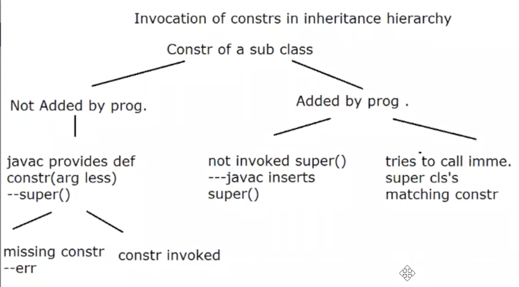
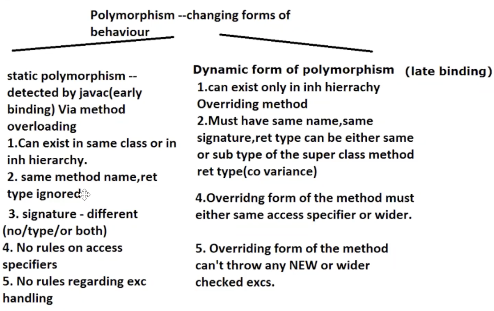

# Why Java?
* Platform Independent — WORA, because .class files can run on any machine as JVM will platform specific
* **Simple** because doesn't support complex features in cpp like multiple inheritance, operator overloading
* **Robust** because it doesn't allow pointer arithmetic (Robust)
* Secure - When the JVM loads the class, it performs verification as part of class loading automatically.
* Object-Oriented
Though java is not 100% Object oriented as it allows primitive data types as well.
**OOP → Encapsulation + Inheritance + Polymorphism + 
* Automatic Memory Management
**JVM → Garbage Collector → automatically manages unused objects** -> Unlike CPP where we need to call destructor everytime to free the memory
* Multithreaded - Java provides built-in support for concurrent execution.
* Functional Programming Support
After Java 8:
Java supports functional-style programming using **lambda expressions, functional interfaces, method references, and Streams**.
It allows Java to express **what should be done** more concisely, especially when processing collections.

* Rich I/O & Networking - Java provides APIs for files, streams, TCP/IP, UDP/IP, URLs, etc.

I/O:
```java
Files.readString(Path.of("data.txt"));
```
Networking:
```java
Socket socket = new Socket("example.com", 80);
```


# Java Security features

You should know it at **two levels**:

### Level 1 — Core Java interview

```text
Java Security
│
├── Strong type checking
├── Encapsulation + access modifiers
├── No explicit pointer arithmetic
├── Automatic memory management
├── Bytecode verification
├── Class Loader
└── Security APIs
    ├── Cryptography
    ├── Certificates
    └── TLS/SSL
```
### Level 2 — Backend/Senior interview: learn these separately
```text
Security & Cryptography
├── Hashing
├── Encryption vs hashing
├── Symmetric encryption
├── Asymmetric encryption
├── Digital signatures
├── Public/private keys
├── Certificates
├── TLS/HTTPS
├── KeyStore
├── Authentication
└── Authorization
```

Why?

Because at your target level, you may be asked things like:

> “How does HTTPS work?”

> “What's the difference between hashing and encryption?”

> “How does a server verify a client's identity?”

> “What is a digital signature?”

> “Where would you store private keys?”

Those are **backend security concepts**, not merely “Java syntax.”

```text
                    JAVA SECURITY
                         │
        ┌────────────────┼────────────────┐
        │                │                │
   LANGUAGE LEVEL     JVM LEVEL       SECURITY APIs
        │                │                │
        ▼                ▼                ▼
 Strong typing      Class Loader      Cryptography
 Encapsulation      Bytecode         Certificates
 No pointers        verification     KeyStore
 Memory safety                       Digital signatures
                                      TLS/SSL
```
# Java Naming Conventions

* **Class/Interface:** `PascalCase` 
* **Method/Variable:** `camelCase` 
* **Constant:** `UPPER_SNAKE_CASE` 
* **Package:** `lowercase` 
* **Enum:** `PascalCase` (constants `UPPER_SNAKE_CASE`)
Definitions -
* **PascalCase** → Each word starts with a capital letter: `BankAccount`
* **camelCase** → First word lowercase, subsequent words capitalized: `accountBalance`
* **UPPER_SNAKE_CASE** → Words uppercase and separated by `_`: `MAX_AMOUNT`
* **lowercase** → All letters lowercase, typically used for packages: `com.bank.account`
* **Enum constants** → Usually `UPPER_SNAKE_CASE`: `PENDING_APPROVAL`
day 1 1 33:06
day1 -> src
```java 
//import java.lang.*; : for all java classes :java.lang package is inherently available
class First{
    public static void main(String[] args){//cmd line args: java First Piyusha Lomte
    //System : name of a class from java.lang.package
    //out : static data member => std output stream
    //out : java.io.PrintStream : print / println / printf
        System.out.println("Welcome to Java!!!");
        System.out.println("Hi there!!!" + args[0] + " " + args[1]);
    }
}
```
save as .java file

# Identifiers
An **identifier** is the **name given by the programmer to identify a program element**.

# Access Specifiers/Modifier in Java

In Java, **access specifiers (access modifiers)** control **where a class, method, variable, or constructor can be accessed from**.

Java has **4 access levels**:

```text
             Same Class   Same Package   Subclass   Other Package
public           ✅            ✅            ✅            ✅
protected        ✅            ✅            ✅            ⚠️
default          ✅            ✅            ❌            ❌
private          ✅            ❌            ❌            ❌
```
* methods? private, default(package-private), protected, public
* which are applicable to top level classes? -> default, public
* `private` and `protected` are allowed for nested classes.


# Basic Definitions and Concepts
* API -> Application Programmer Interface
* Package -> collection of functionally similar classes
* java.lang package by default available always inherently
* import -> to avail
* syntax of import outside of class always
* Java follows single root inherentance hierarchy-> all classes implicitly extend **Object class**
* System-> static class having fields in, out
* out has type PrintStream(from java.io package) which is another class shows -> HAS-A relationship
* src -> java files
* bin -> .class files
* to generate .class files in bin folder use command -> javac -d ..\bin File.java
* ```cd ..\bin``` (go to bin folder to run the class file) -> ```java File``` (case - sensitive file name)

* Java is both compiled and interpreted language
* it is platform independent because JVM is platform specific - .class files will be platform independent -> JVM creates platform specific bytecodes
* JDK = Java dev tools(javac, java, javap, jar,jar signer, appletviewer) + JRE( Java API libs ) + JVM (containing 1. class loader, 2. Interpreter, 3. JIT compiler, 4. HotSpot profiler)
```text
                     ┌──────────────────────────────────────┐
                     │     JDK (Java Development Kit)       │
                     └──────────────────┬───────────────────┘
                                        │
         ┌──────────────────────────────┴──────────────────────────────┐
         │                                                             │
┌────────┴──────────────┐                                   ┌──────────┴────────────┐
│    Java Dev Tools     │                                   │          JRE          │
│                       │                                   │(Java Runtime Environ.)│
├─ javac (Compiler)     │                                   └──────────┬────────────┘
├─ java (Launcher)      │                                              │
├─ javap (Disassembler) │                                              ├─ Java API Libs
├─ jar (Archiver)       │                                              │
├─ jar signer           │                                              └─ JVM (Java Virtual Machine)
└─ appletviewer         │                                                   ├─ 1. Class Loader
                        │                                                   ├─ 2. Interpreter
                        │                                                   ├─ 3. JIT Compiler
                        │                                                   └─ 4. HotSpot Profiler
                        └───────────────────────┬────────────────────────────────┘
                                                │
                                                ▼
                                     (Executes the Bytecode)

```
* Java src code -->(Java compiler) --> ByteCode -->(JIT compiler) --> Native code 
* class files -> class loader -><- Runtime data areas(Method area + Heap + Java stacks + PC registers + Native method stacks) -><- Execution Engine -><- Native method interface -> native method library

* Java Hot Spot -> adaptive learning like AI
* main function expects String, we'll parse string to num to calculate the sum and avoid concatenation

# Assignment 1

CoreJava/src/java01/Sum.java
```java
package java01;

public class Sum {
    public static void main(String[] ss){
        int num1 = Integer.parseInt(ss[0]);
        int num2 = Integer.parseInt(ss[1]);
        System.out.println("Sum="+(num1 + num2));
    }
}
```
```shell
piyushalomte@Piyushas-MacBook-Pro ~ % cd Documents
piyushalomte@Piyushas-MacBook-Pro Documents % cd Learn-Java
piyushalomte@Piyushas-MacBook-Pro Learn-Java % code . 
piyushalomte@Piyushas-MacBook-Pro Learn-Java % mkdir -p CoreJava/bin/java01
piyushalomte@Piyushas-MacBook-Pro Learn-Java % javac -d CoreJava/bin CoreJava/src/java01/Sum.java
piyushalomte@Piyushas-MacBook-Pro Learn-Java % java -cp CoreJava/bin java01.Sum 10 20
Sum=30
```
# Static Method ->
In Java, a **static method belongs to the class, not to an object**. So there are several ways you may see it called.

### 1. Using the class name — ✅ Recommended

```java
class Calculator {
    static int add(int a, int b) {
        return a + b;
    }
}

public class Main {
    public static void main(String[] args) {
        int result = Calculator.add(10, 20);
        System.out.println(result);
    }
}
```
> A static method should normally be called using the class name because it belongs to the class rather than an instance.

---

### 2. Directly by method name from the same class

```java
class Calculator {

    static void greet() {
        System.out.println("Hello");
    }

    public static void main(String[] args) {
        greet();
    }
}
```

This works because `main()` and `greet()` are both static methods of the same class.

You can also write:

```java
Calculator.greet();
```

Both work.

---

### 3. Using an object — ⚠️ Possible, but not recommended

```java
class Calculator {
    static void greet() {
        System.out.println("Hello");
    }
}

public class Main {
    public static void main(String[] args) {
        Calculator c = new Calculator();

        c.greet();   // Works, but NOT recommended
    }
}
```

Java allows this, but the compiler treats the call as a **static method invocation based on the type**, not as an instance-method call.

Conceptually, prefer:

```java
Calculator.greet();
```

instead of:

```java
c.greet();
```

---

### 4. Through inheritance

Static methods can be inherited by a subclass.

```java
class Parent {
    static void show() {
        System.out.println("Parent");
    }
}

class Child extends Parent {
}

public class Main {
    public static void main(String[] args) {
        Child.show();   // Works
    }
}
```

But remember: **static methods are hidden, not overridden.**


### ⭐ One important point

This is why you often see:

```java
public static void main(String[] args)
```

The JVM can invoke `main()` **without creating an object**:

```text
JVM
 ↓
Main.main(args)
```

because `main()` is static.

> **The JVM invokes the `main` method as the application's entry point using the class name and the required `String[]` signature. Inside a static context, static methods can be invoked directly by method name if they are accessible.**

And one correction to my previous answer: **“same class” is a simplification.** A static method can also be called by its simple name when it is inherited or statically imported and is accessible.


# Java Data Types
Java is **statically typed**, so a variable's type is known at compile time.

```text
Java Data Types
│
├── Primitive
│   ├── byte
│   ├── short
│   ├── int
│   ├── long
│   ├── float
│   ├── double
│   ├── char
│   └── boolean
│
└── Reference
    ├── Class/Object
    ├── String
    ├── Array
    ├── Interface
    ├── Enum
    └── Record
```

## 1. Primitive Types

| Type      |                         Size | Typical use                         |
| --------- | ---------------------------: | ----------------------------------- |
| `byte`    |                        8-bit | Small integers                      |
| `short`   |                       16-bit | Rare in application code            |
| `int`     |                       32-bit | Default integer choice              |
| `long`    |                       64-bit | Large integers / IDs                |
| `float`   |                       32-bit | Lower-precision decimal             |
| `double`  |                       64-bit | General floating-point calculations |
| `char`    |                       16-bit | Single UTF-16 code unit             |
| `boolean` | JVM-dependent representation | `true` / `false`                    |

### Practical choices

```text
Normal integer       → int
Large integer / ID   → long
Floating point       → double
Money                → BigDecimal
Boolean              → boolean
Text                 → String
Single character     → char
```

**Do not use `double` for financial amounts. Use `BigDecimal`.**

```java
BigDecimal amount = new BigDecimal("100.50");
```

Avoid:

```java
new BigDecimal(100.50); // may capture binary floating-point approximation
```

## 2. Reference Types

Reference variables refer to objects.

```java
BankAccount account = new BankAccount();
String name = "Piyusha";
int[] amounts = {100, 200, 500};
```

Common reference types:

* Classes
* Objects
* Arrays
* Interfaces
* Strings
* Enums
* Records

Example:

```java
List<String> names = new ArrayList<>();
```

`List` is the reference type/interface and `ArrayList` is the implementation.

## 3. Primitive vs Reference

| Primitive        | Reference                                |
| ---------------- | ---------------------------------------- |
| 8 built-in types | Classes, arrays, interfaces, enums, etc. |
| Stores a value   | Holds a reference to an object           |
| Cannot be `null` | Can be `null`                            |
| `int`            | `Integer`                                |
| `double`         | `Double`                                 |
| `boolean`        | `Boolean`                                |

## 4. Wrapper Classes

```text
byte      → Byte
short     → Short
int       → Integer
long      → Long
float     → Float
double    → Double
char      → Character
boolean   → Boolean
```

Collections use wrapper types because generics work with reference types:

```java
List<Integer> numbers = new ArrayList<>();
```

Not:

```java
List<int> numbers; // invalid
```

### Autoboxing / Unboxing

```java
Integer x = 100; // autoboxing
int y = x;       // unboxing
```

Autoboxing and generics were introduced in **Java 5**.

## 5. `null`

Primitives cannot be `null`:

```java
int age = null;       // invalid
```

Reference variables can:

```java
Integer age = null;   // valid
String name = null;   // valid
```

`null` means a reference currently refers to no object.

## 6. Default Values

Instance/static fields receive default values:

```text
byte/short/int   → 0
long             → 0L
float            → 0.0f
double           → 0.0d
char             → '\u0000'
boolean          → false
reference        → null
```

Local variables do **not** receive automatic default values.

```java
void test() {
    int count;
    System.out.println(count); // compile-time error
}
```

## 7. Type Conversion

### Widening — automatic

```java
int x = 100;
long y = x;
```

### Narrowing — explicit cast - type casting

```java
long x = 100;
int y = (int) x;
```

Narrowing can lose information:

```java
double amount = 100.99;
int value = (int) amount;

// value = 100
```
> popular interview point -> long -> float is considered automatic type of conversion(widening) 
> Rule -> src and dest must be compatible, dest should store larger magnitude values than src data type.
**FLOAT > LONG**
* Any arithmetic operation results in bigger data type
```java
class TestPrimTypes{
    public static void main(String[] args){
        byte b1 = 12;
    }
}
```
No compiler error
```java
class TestPrimTypes{
    public static void main(String[] args){
        byte b1 = 128;
    }
}
```
compiler error - exceeded the range.
```java
class TestPrimTypes{
    public static void main(String[] args){
        byte b1 = 12;
        short s = b1;
    }
}
```
No compiler error - automatic conversion
```java
class TestPrimTypes{
    public static void main(String[] args){
        byte b1 = 12;
        short s = b1;
        byte b2 = 10;
        byte b3 = 5;
        byte b4 = (b2 + b3);
    }
}
```     
compiler error : compiler goes by the type : incompatible types here byte and int
* **Any arithmetic operation** involving bytes or shorts or combination automatically **promotes** to int
You can do either ```int b4 = (b2 + b3);``` or ```byte b4 = (byte)(b2 + b3);```

```java
class TestPrimTypes{
    public static void main(String[] args){
        byte b1 = 12;
        b1 += 10;
    }
}
```
No compiler error
* **Any compound assignment operators(-=,+=,*=),Simple assignment(=),Bitwise(&, |), shift operators(<<,>>),ternery expression(?:)** performs implicit type casting.
```java
class TestPrimTypes{
    public static void main(String[] args){
        float f1 = 5.67;
    }
}
```
compiler error -> float can't allow double precision
Solution- ```float f1 = 5.6;``` or ```float f1 = 5.67F;``` or ```float f1 = (float)5.67;```
```java
class TestPrimTypes{
    public static void main(String[] args){
        float f1 = 5.67F;
        double d = f1;
    }
}
```
No compiler error
```java
class TestPrimTypes{
    public static void main(String[] args){
        float f1 = 5.67F;
        double d = f1;
        long l1 = f1;
    }
}
```
error- float to long is not automatic conversion, long to float is automatic
```java
class TestPrimTypes{
    public static void main(String[] args){
        int count = 10;
        if(count == 10)
            System.out.println("Yes");
        else
            System.out.println("No");
        long l = 123456789;
        short s = 10;
        s = s * 2; // arithmetic operation gives incompatible type error
        int i1 = 11/2; // compatible types
        char ch = 'A';
        ch = 70;//allowed, takes as unicode value
    }
}
```
## 8. Overflow

```java
int x = 2_147_483_647;
x++;
```

The value wraps around because the maximum `int` value was exceeded.

Use `long` when the domain requires a larger integer range.

```java
class  TestPrimTypesRanges{
    public static void main(String[] args){
        System.out.println("byte Range " + Byte.MIN_VALUE + " -- " + Byte.MAX_VALUE);
        System.out.println("int Range " + Integer.MIN_VALUE + " -- " + Integer.MAX_VALUE);
        System.out.println("long Range " + Long.MIN_VALUE + " -- " + Long.MAX_VALUE);
        System.out.println("float Range " + Float.MIN_VALUE + " -- " + Float.MAX_VALUE);
    }
}
```


**Q: How many primitive types does Java have?**

8.

**Q: Is String a primitive?**

No. `String` is a class/reference type.

**Q: Can int store null?**

No.

**Q: Can Integer store null?**

Yes.

**Q: Why use BigDecimal for money?**

Because binary floating-point types such as `double` are not suitable for exact decimal financial arithmetic.

**Q: Why use Integer instead of int?**

When an object/reference representation is required, such as with generics/collections, or when `null` needs to represent absence.

**Q: What is the difference between widening and narrowing?**

Widening converts to a type with a larger compatible range and is generally implicit; narrowing converts to a smaller type and requires an explicit cast because information may be lost.

**Java version note:** The eight primitive types are part of Java's original language fundamentals (Java 1.0). Wrapper classes, autoboxing/unboxing, and generics were introduced in **Java 5**.

Range check -> Byte.MIN_VALUE or MAX_VALUE, Integer,Long,Float

# Basic Rules
1. Java compiler doesn't allow accessing of un initialized LOCAL data members.
2. Files with no public classes(default scoped) can have a name that does not match with any classes in the file.
3. A file can have more than one non public classes.
4. There can be only one public class per source code file.
5. If there is a public class in a file, the name of the file must match the name of the public class. For example, a class declared as public class Example{ ... } must be in a source code file named Example.java
TestBasicRules.java
```java
class TestBasicRules{}
```
compile & run -> compiles well, but runtime error (needs main method to run)
TestBasicRules.java
```java
class TestBasicRules{}
class A{}
class B{}
class C{}
```
compiles well but runtime error due to absence of main method
so multiple non - public classes allowed, yes.
one .class file created per class
TestBasicRules.java
```java
class TestBasicRules{}
public class A{}
class B{}
class C{}
```
Error - class A is public should be declared in A.java file
TestBasicRules.java
```java
public class TestBasicRules{}
public class A{}
class B{}
class C{}
```
2 public classes in a file Not allowed 
```java
public class TestBasicRules{
    public static void main(String[] ss){
        System.out.println("1234");
    }
}
class A{
    public static void main(String[] ss){
        System.out.println("5678");
    }
}
class B{}
class C{}
```
No compiler error
No runtime error
to get 1234 printed, run -> java TestBasicRules
to get 5678 printed, runt -> java A
```java
class TestBasicRules{
    public static void main(String[] args){
        int data;// primitive type
        System.out.println("data=" + data);
        String s;//reference type
        System.out.println("s="+s);
    }
}
```
Compiler error on line no. 911, 913 -> 
declaring uninitialized **LOCAL** variables allowed, accessing them is not allowed NO MATTER THEY ARE PRIMITIVE OR REFERENCE.
```java
class TestBasicRules{
    public static void main(String[] args){
        int data = 100;
        System.out.println("data=" + data);
        if(data)    
            System.out.println("Yes");
        else        
            System.out.println("No");
        }
}
```
compiler error because if,while, do-while conditions requires boolean
Java has strong type checking

# Assignment 1
1:33:00 + 2:28:00 in core java day1 2
1. Accept i/ps from user, till user enters"quit" or any other option.
Input: operation(add | sub | mult | div), number1(double), number2(double)
Display the result.
Give the best **USER EXPERIENCE**, where to take inputs inside switch case or outside.
* Hints for Assignments
```text
boolean exit = false;
//Scanner obj.
while(!exit){
    sop("Menu: 1.Add 2. .. 5. Exit");
    sop("Choose option & enter inputs");
    sc.nextDouble() to get input
    switch(sc.nextInt()){
        case 1 : ..
        case 2 : ..
        ..
        case 5 : exit = true; //or default case
        break;
    }
}
```
* Scanner object has to be outside the loop.
2. Accept 2 double values from command line argument. compute it's average.
(Hint : Double.parseDouble())
3. Display food menue to user. Assign fixed prices to food items.
User will select items from menu along with the quantity.(1. Dosa, 2. Samosa, 3. Rice, .. 10. Generate bill)
When User enters "Generate bill" option, display total bill & exit.
* method to exit can be ```System.exit(0);``` to terminate java application or ```exit = true;```
* Here if - else,for, do, while, continue, break, >>,>>>,Shift operators covered through ppt

4. Use Scanner to accept 2 inputs, Check its data type, if int, accept ints and comput average otherwise print error message "Invalid 1st number" or "Invalid 2nd number"
(Hint - by checking - hasNextInt(), if valid, accept by using nextInt() or print error)

# Scanner class
* java.util package, .* -> only load the required classes
* A Scanner breaks its input into tokens using a delimiter, space by default
* Throws inputMismatchException
* Steps
1. import java.util.Scanner;
2. create instance
3. check the data type hasNextInt/Byte/Long()
4. read and parse data nextInt/Double/Line/Boolean() or just next()
5. before terminating app, close the scanner
* print() - print on same line
* println() - print on the next line
* printf() - format and print
Write a java application to accept int(emp id), double(salary), emp's first name, emp id, salary, name, permanent status : bolean from Scanner & display the same using printf.
```java
import java.util.Scanner;
class TestScanner{
    public static void main(String[] args){
        Scanner sc = new Scanner(System.in);
        System.out.println("Enter emp id, salary, name, permanent status, grade");
        System.out.printf("Emp ID %d Salary %.1f Name %s isPermanent %b Grade %c%n", sc.nextInt(),sc.nextDouble(),sc.next(),sc.nextBoolean(),sc.next().charAt(0));
        sc.close();
    }
}
```
* sc.next() returns String -> go to String class -> charAt(int index) -> will give the char -> method chaining, There is no direct nextChar type method in Scanner
* sc.close() -> not necessary for System.in class because of automatic memory management but good practice to continue for sockets, databases, they do need to be closed explicitly.

* sc.next() moves the pointer ahead so you can't read the same char twice, if you want to read it multiple times, save the char in string variable and use it multiple times.
* sc.hasNext() doesn't move pointer, it's like only peeking
* Static method overloading is allowed, overriding is not allowed.
* Main is static method, 2 main methods with different signature allowed, same signature not allowed.(String[]) is main entry point, other method with just String allowed

# Revision Questions:
* Why Java? platform independence(WORA), any platform, any database,any web server
* how platform independent -> JVM is machine specific
* Only runtime needs a main method, so you can definitely compile java class without main.
* Can you write a java class without main and compile it? YES
* Can you write a java class without main and run it? NO
* What are legal access specifiers for members(data members & methods)? private, default, protected, public
* which are applicable to top - level classes in heirarchy? -> default, public
* can a java src file contain multiple default classes? : YES
* can a java src file contain multiple public classes? : NO
* Any rules regarding default class name & src file name? : NO
* Any rules regarding public class name & src file name? : YES
* Reference holds address(internal representation of address) 
* Pointer arithmetic -> means operator attaching to reference type -> sc++; or sc += 10; ->not allowed in java

* revise automatic and explicit type conversions

# JVM Architecture or Java memory areas
Test.java
compile from src folder
javac -d ..\bin Test.java
cd bin
java Test
When you run:

```bash
java MyProgram
```

the JVM creates runtime memory areas.

Conceptually:

```text
                     JVM PROCESS
                         │
          ┌──────────────┴──────────────┐
          │                             │
      SHARED                        PER THREAD
          │                             │
     ┌────┴────┐              ┌─────────┼─────────┐
     │         │              │         │         │
   HEAP   METHOD AREA       Stack      PC      Native
                          Thread 1   Register    Stack
                          Thread 2
                          Thread 3
```

The most important distinction:

> **Heap and Method Area are shared between threads. Stack and PC Register are thread-specific.**
> Native method Stack is not written in java, it is written in executable languages, just if our program needs to call native methods
---


## 9. Heap vs Stack

| Heap                                    | Stack                              |
| --------------------------------------- | ---------------------------------- |
| Shared among threads                    | Each thread has its own            |
| Objects/arrays                          | Stack frames                       |
| Managed by GC                           | Frames removed as methods return   |
| Generally larger                        | Generally smaller                  |
| Lifetime depends on object reachability | Lifetime tied to method invocation |
| `new BankAccount()` object              | `account` local reference          |


> **"Local variables are represented in a method's stack frame, while objects and arrays are allocated in the heap. JVM implementations may optimize or eliminate allocations, so this is a conceptual model rather than a guarantee of physical memory placement."**

That's senior-level wording.

---

## StackOverflowError vs OutOfMemoryError
```text
Stack too deep → StackOverflowError

Heap allocation cannot be satisfied → OutOfMemoryError
```

---

## Follow-up questions you should be ready for

You should be able to answer these next:

1. **What exactly is stored in the heap?**
2. **What exactly is stored in a stack frame?**
3. **Heap vs stack?**
4. **Why is stack thread-specific?**
5. **Why is heap shared?**
6. **What is garbage collection?**
7. **When does an object become eligible for GC?**
8. **What is StackOverflowError?**
9. **What is OutOfMemoryError?**
10. **What is Metaspace?**
11. **What happened to PermGen?**
12. **Where are static variables stored?**
13. **Where are local variables stored?**
14. **Where are String objects stored?**
15. **What happens in memory when `new` is used?**
16. **What happens when one method calls another?**
# Java Class Declaration
A **class** is a blueprint for creating objects. A class declaration defines the class name, its access/modifier rules, inheritance, implemented interfaces, and its members.

### General Syntax

```java
[access modifier] [other modifiers] class ClassName
        [extends ParentClass]
        [implements Interface1, Interface2] {

    // fields
    // constructors
    // methods
}
```
* A top-level class can be public or package-private:

* A top-level class **cannot** be: `private` and `protected` are allowed for nested classes.

* If a top-level class is `public`, the filename must match the class name.

* A `.java` file can contain multiple top-level classes:

* But there can be **at most one public top-level class** in the file.

* The public class determines the filename.

* A class can extend **only one class**.

* Java does not support multiple class inheritance.

```text
extends → maximum ONE class
```
* A class can implement multiple interfaces.

```text
implements → MULTIPLE interfaces allowed
```
The order is:

```text
extends
   ↓
implements
```
* An abstract class cannot be directly instantiated.
A concrete subclass can extend it:
Use an abstract class when you want to provide a common base and potentially require subclasses to implement certain behavior.

* A `final` class cannot be extended.

* `String` cannot be subclassed. It's a final class.

* **Sealed classes became a permanent Java feature in Java 17.**

A sealed class restricts which classes can extend it.

```java
public sealed class Payment
        permits UpiPayment, CardPayment {
}
```

Permitted subclasses must declare themselves as one of:

```text
final
sealed
non-sealed
```

Example:

```java
public sealed class Payment
        permits UpiPayment, CardPayment {
}

final class UpiPayment extends Payment {
}

non-sealed class CardPayment extends Payment {
}
```

This is useful when the domain has a controlled set of subtypes.

Example:

```text
Payment
├── UpiPayment
└── CardPayment
```

---

* Common Class Modifiers

| Modifier     | Meaning                                            |
| ------------ | -------------------------------------------------- |
| `public`     | Accessible wherever the class itself is accessible |
| `abstract`   | Cannot be instantiated directly                    |
| `final`      | Cannot be extended                                 |
| `sealed`     | Restricts permitted subclasses                     |
| `non-sealed` | Opens inheritance under a sealed hierarchy         |

* Quick Revision

```text
1. Class name must be a valid identifier.

2. Top-level class can be public or package-private.

3. Top-level class cannot be private/protected.

4. A public top-level class must match the filename.

5. A source file can have multiple top-level classes,
   but at most one can be public.

6. A class can extend only ONE class.

7. A class can implement MULTIPLE interfaces.

8. `extends` comes before `implements`.

9. Abstract classes cannot be instantiated directly.

10. Final classes cannot be extended.

11. Sealed classes restrict permitted subclasses. - permits keyword

12. Sealed classes became final in Java 17.
```
* Q1. Can a class extend multiple classes? No.
* Can a class implement multiple interfaces? Yes.
* Can a top-level class be private? No.
* Can a `.java` file contain multiple classes? Yes, but at most one top-level class can be `public`.
* What determines the filename? The public top-level class.
* Can an abstract class be instantiated? No.
* Can a final class be inherited? No.
* What is a sealed class?
A class that explicitly restricts which classes can extend it.
* When did sealed classes become a permanent Java feature?
* `extends` vs `implements`?
```text
extends     → inherit from a class
implements  → implement one or more interfaces
```
## Interface Declaration Rules

An **interface** defines a contract that implementing classes agree to follow.

General syntax:

```java
[access modifier] [modifier] interface InterfaceName
        [extends Interface1, Interface2] {

    // constants
    // abstract methods
    // default methods
    // static methods
    // private methods
}
```

### Interface Rules

1. Interface name must be a valid identifier.
2. Naming convention is **PascalCase**.
3. A top-level interface can be:

   * `public`
   * package-private

4. A top-level interface cannot be:

   * `private`
   * `protected`

   However, a **nested interface** can use `private`, `protected`, or `public`.

5. A public top-level interface must have the same filename as the interface.
6. Interface fields are implicitly:

```java
public static final
```

So:

```java
interface BankConfig {
    int MAX_TRANSACTION = 100000;
}
```

is equivalent to:

```java
interface BankConfig {
    public static final int MAX_TRANSACTION = 100000;
}
```

7. Interface fields must be initialized.

```java
interface Config {
    int LIMIT = 1000;  // valid
}
```

8. Interface methods are implicitly `public` and `abstract` **unless they are `default`, `static`, or `private` methods**.

```java
interface Transferable {
    void transfer();
}
```

is equivalent to:

```java
interface Transferable {
    public abstract void transfer();
}
```

9. A class uses `implements` to implement an interface.
10. A class can implement multiple interfaces.
11. An interface can extend multiple interfaces.
This is one major difference from class inheritance:

```text
Class → extends → ONE class
Class → implements → MANY interfaces

Interface → extends → MANY interfaces
```
12. An interface cannot extend a class.
13. An interface cannot be instantiated directly.
14. An interface reference can point to an implementing object.

```java
Transferable t = new BankAccount(); // ✅
```

This demonstrates **polymorphism**.
15. Interface methods can have implementations.
16. Static methods in interfaces were introduced in **Java 8**.

```java
interface PaymentUtil {

    static void log() {
        System.out.println("Payment logged");
    }
}
```

Called using the interface:

```java
PaymentUtil.log();
```

17. Private interface methods were introduced in **Java 9**.

```java
interface PaymentUtil {

    private void audit() {
        System.out.println("Audit");
    }

    default void process() {
        audit();
    }
}
```

18. An interface can be nested inside another class or interface.

```java
class Bank {

    interface PaymentRule {
        boolean isValid();
    }
}
```

Usage:

```java
class Payment implements Bank.PaymentRule {

    @Override
    public boolean isValid() {
        return true;
    }
}
```

A nested interface declared inside another interface is implicitly `public static`.

```java
interface Bank {

    interface PaymentRule {
        boolean isValid();
    }
}
```

Conceptually:

```java
public static interface PaymentRule
```

19. Since Java 8, interfaces can contain:

* abstract methods
* default methods
* static methods

Since Java 9:

* private methods

20. Since Java 17, interfaces can also participate in sealed hierarchies.

```java
public sealed interface Payment
        permits UpiPayment, CardPayment {
}
```

Implementations must follow the sealed hierarchy rules.

---

## Nested Class vs Interface

| Feature                      | Nested Class                               | Nested Interface                      |
| ---------------------------- | ------------------------------------------ | ------------------------------------- |
| Declared inside another type | Yes                                        | Yes                                   |
| Can be instantiated directly | Depends on type                            | No                                    |
| Can have fields              | Yes                                        | Yes, implicitly constants             |
| Can have constructors        | Yes, except anonymous classes              | No                                    |
| Can have instance state      | Yes                                        | No                                    |
| Can have methods             | Yes                                        | Yes                                   |
| Can be `private`             | Yes                                        | Yes, when nested                      |
| Can be `static`              | Static nested class                        | Nested interface is implicitly static |
| Main purpose                 | Encapsulate closely related implementation | Define a related contract             |

---

A nested interface can define a contract closely related to the enclosing class:

```java
public class PaymentService {

    public interface PaymentProcessor {
        void process();
    }
}
```

Implementation:

```java
class UpiProcessor
        implements PaymentService.PaymentProcessor {

    @Override
    public void process() {
        System.out.println("Processing UPI payment");
    }
}
```

* Can a class be declared inside another class?
Yes. It is called a nested class.

* What is the difference between static nested class and inner class?
A static nested class does not require an outer-class instance; an inner class does.

* Can an inner class access private members of the outer class?
Yes.

* Can a class extend multiple classes?
No.

* Can a class implement multiple interfaces?
Yes.

* Can an interface extend multiple interfaces?
Yes.

* Can an interface extend a class?
No.

* Can an interface be instantiated?
No.

* What are interface variables by default?
`public static final`.

* What are normal interface methods by default?
`public abstract`, unless they are `default`, `static`, or `private`.

* When were default and static interface methods introduced?
Java 8.

* When were private interface methods introduced?
Java 9.

* Can a nested interface be private?
Yes, when declared inside a class or another suitable enclosing type.

```text
Nested Classes
→ Static nested → no outer object
→ Inner         → needs outer object
→ Local         → inside method/block
→ Anonymous     → no class name

Classes
→ extends ONE class
→ implements MANY interfaces

Interfaces
→ extends MANY interfaces
```

### Version Note

```text
Nested classes/interfaces → core Java feature (Java 1.1-era nested types)

Default interface methods → Java 8
Static interface methods  → Java 8
Private interface methods → Java 9
Sealed interfaces         → Java 17
```
# Object-Related Concepts

## 1. Object

An **object** is an instance of a class. It has **state (fields)** and **behavior (methods)**.

```java
BankAccount account = new BankAccount();
```

```text
class  → blueprint
object → actual instance
```

---

## 2. Constructor

A **constructor** initializes an object when `new` is used.

```java
class BankAccount {

    BankAccount() {
        System.out.println("Account created");
    }
}
```

Rules:

* Same name as the class.
* No return type, not even `void`.
* Called automatically when an object is created.
* Can be overloaded.
* Not inherited.
* If no constructor is written, Java provides a default no-arg constructor **only if the class has no constructor**.

```java
BankAccount account = new BankAccount();
```

---

## 3. `this` Keyword

`this` refers to the **current object**.

### Common uses

**1. Resolve field/parameter name conflict**

```java
class Account {

    private String number;

    Account(String number) {
        this.number = number;
    }
}
```

**2. Call another constructor**

```java
Account() {
    this("UNKNOWN");
}
```

**3. Pass current object**

```java
process(this);
```

**4. Return current object**

```java
return this;
```

Memory trick:

```text
this = current object
```

---

## 4. `new` Keyword

`new` creates an object and invokes its constructor.

```java
BankAccount account = new BankAccount();
```

Conceptually:

```text
new
 ↓
create object
 ↓
constructor runs
 ↓
reference returned
```

---

## 5. Reference Variable

A reference variable stores a **reference to an object**, not the object itself.

```java
BankAccount account = new BankAccount();
```

```text
account ───────→ BankAccount object
```

Multiple references can point to the same object:

```java
BankAccount a = new BankAccount();
BankAccount b = a;
```

```text
a ──┐
    ├──→ same object
b ──┘
```

---

## 6. `null`

`null` means a reference points to **no object**.

```java
BankAccount account = null;
```

Calling a method through it causes:

```java
account.deposit(); // NullPointerException
```

---

## 7. Constructor vs Method

| Constructor                   | Method                                          |
| ----------------------------- | ----------------------------------------------- |
| Initializes object            | Performs behavior                               |
| Same name as class            | Any valid name                                  |
| No return type                | Has return type or `void`                       |
| Called during object creation | Called explicitly                               |
| Not inherited                 | Can be inherited/overridden depending on method |

---
> **“An object is an instance of a class. A constructor initializes an object when it is created using `new`. The `this` keyword refers to the current object and is commonly used to distinguish instance fields from parameters or to invoke another constructor. A reference variable holds a reference to an object, while `null` represents the absence of an object reference.”**

```text
Class → blueprint
Object → instance
new → creates object
Constructor → initializes object
this → current object
Reference → points to object
null → points to no object
```

## Object Lifecycle — Compact Flow

```text
Class loaded
    ↓
new BankAccount(...)
    ↓
Memory allocated for object
    ↓
Instance fields get default values
    ↓
Constructor executes
    ↓
Object becomes usable
    ↓
Reference(s) point to object
    ↓
Object is used
    ↓
References are removed / object becomes unreachable
    ↓
Eligible for Garbage Collection
    ↓
GC reclaims memory
```

```java
BankAccount account = new BankAccount("123");
```

```text
new
 ↓
allocate object
 ↓
default field values
 ↓
constructor runs
 ↓
account ──→ object
 ↓
object used
 ↓
account = null
 ↓
object may become unreachable
 ↓
eligible for GC
```
**Garbage Collection is automatic, but becoming eligible for GC does not mean the object is immediately destroyed.**

# Assignment 2 ->
Create a java application for the following
1.1 Create a class to represent 3D Box. Provide tight encapsulation Data members(instance variables = state) -width, height, depth : double --- private
1.2 Add a constructor - to init  state of the box
1.3 Add a business logic in instance methods
1. To return Box details in string form (dims of Box)
method declaration -- access specifier, ret type, name, args method def -- body 
2. return computed volume of the box
1.4 Create a TestBox class, which allows user to supply 3 dims as user inputs via scanner. create Box object and display volume.

```java
class Box{
    //state : properties/ attributes/ non data members : instance vars : Heap
    private double width, depth, height;// instance variables.
    Box(double w,double d, double height){//this height is local variable
        width = w;
        depth = d;
        this.height = height;// to resolve conflict between local variable and instance variable
    }
    String getDetails(){
        return "Box Dims" + this.width + " " + depth + " " + height;
    }
    double computeVolume(){
        return width*depth*height;
    }
}
```
```java
import java.util.Scanner;
class TestBox{
    public static void main(String[] args){
        int data;
        System.out.println(data);
        Scanner sc = new Scanner(System.in);
        System.out.println("Enter Box dims: width depth height");
        Box b1;
        b1 = new Box(sc.nextDouble(), sc.nextDouble(), sc.nextDouble());
        System.out.println(b1.getDetails());
        System.out.println(b1.computeVolume());
        sc.close();
    }
}
```
* when you provide your own constructor, default is no longer available from compiler
* TestBox and Box have USES-A relationship- there are 3: IS-A, HAS-A, USES-A
# Memory Diagrams
* Stack Heap Method area, class pointer
* java.lang.NullPointerException
* unreachable object marked for GC

# Garbage Collection
* JVM creates 2 threads 
* main thread(executes main sequentially) - foreground thread
* G.C. -- deamon thread -- background thread - JVM activates it periodically(only if required) -- GC releases the memory occupied by un-referenced objects allocated on the heap(the obj whose no. of ref = 0)
* How to request for GC? -> API of System class -> ```public static void gc()```
* Object class API -> ```protected void finalize() throws Throwable``` -> Automatically called by the garbage collector on an object before garbage collection of the object takes place.
* overriding finalize() is not a good idea because it isn't called then and there anyway, it is called only if it is required by JVM(when no memory left and urgently we need to cleanup)
* Releasing of non-java resources. (closeing of DB connection, closing file handles, closing socket connection) is NOT done automatically by GC
* Marking Objects for GC and clearing them is different. We can't predict clearing by GC but marking to GC can be predicted for sure
* Triggers for marking the object for GC :
1. Nullifying all valid refs.
2. re-assigning the reference to another object
3. Object created within a method & its ref NOT returned to the caller
Box b1 = new Box(1,2,3);
b1 = new Box(1,2,3);// earlier object marked for GC
whenever we use 'new' keyword, new object will be created for sure.
4. Island of isolation

* Method area will get empty when JVM terminates, class unloading happens, GC doesn't clear method area, GC works mainly on heap
* **Garbage Collection** is the JVM's automatic process of reclaiming memory occupied by objects that are **no longer reachable**.
* **Automatic** — JVM manages it; developers don't explicitly free objects.
* Works mainly on the **Heap**.
* An object becomes **GC-eligible when it is unreachable**.
* GC does **not** mean immediate destruction.
* `System.gc()` is only a **request/hint**, not a guarantee.
* GC primarily reclaims **unreachable objects**, not simply objects whose variables are set to `null`.
* Multiple references can keep an object reachable.
* Java can have different **Garbage Collectors** optimized for different goals.
* GC involves a trade-off between **throughput, latency, and memory usage**.
* **Stop-the-world (STW)** pauses can occur during GC, though modern collectors minimize pause time.
* Objects generally become harder/less expensive to collect as they survive longer; generational collectors exploit this.
* `OutOfMemoryError` can occur when the JVM cannot satisfy memory allocation, even though GC runs.
* **Memory leak in Java** can still happen when unwanted objects remain reachable, e.g. through static collections, caches, listeners, or `ThreadLocal`s.
* `finalize()` is **deprecated for removal** and should not be used for resource cleanup.
* Use **try-with-resources** for resources such as files, sockets, and DB connections; GC is not a replacement for explicit resource management.

### GC Roots

Objects can remain reachable through GC roots such as:

```text
Active thread references
Static references
Local variables / stack references
JNI references
```
> “Garbage Collection is the JVM's automatic memory-management mechanism that identifies objects that are no longer reachable and reclaims their heap memory. An object becoming eligible for GC does not mean it is immediately collected. Modern JVMs use different collectors and may perform concurrent and stop-the-world phases to balance throughput, latency, and memory usage.”

**Q: Where does GC mainly work?**
Heap.

**Q: When is an object eligible for GC?**
When it is no longer reachable from GC roots.

**Q: Does `System.gc()` force GC?**
No. It only requests/suggests GC.

**Q: Can Java have memory leaks?**
Yes. Objects can remain reachable even when they are no longer logically needed.

**Q: Does GC clean stack memory?**
No. Stack frames are managed as method calls return; GC primarily manages heap objects.

**Q: Is GC immediate after `obj = null`?**
No. The object only becomes potentially GC-eligible if no other reachable reference exists.

**Q: Is `finalize()` recommended?**
No. It is deprecated for removal.

**Q: What does `OutOfMemoryError` mean?**
The JVM could not satisfy a memory allocation request; it does not necessarily mean GC never ran.

# Daemon Thread

A **daemon thread** is a background thread that provides services to other threads and **does not keep the JVM alive**.
* Runs in the **background**.
* JVM does **not wait** for daemon threads to finish.
* JVM exits when all **non-daemon** threads finish.
* A daemon thread may be terminated when JVM exits.
* Must call `setDaemon(true)` **before** `start()`.
* By default, a newly created thread inherits the daemon status of its parent thread.
* Common use: background/support tasks.
* **GC is not simply “a daemon thread”** — Garbage Collection is a JVM subsystem and collector implementation may use multiple internal threads.
```java
Thread t = new Thread(() -> {
    while (true) {
        System.out.println("Background work");
    }
});

t.setDaemon(true);
t.start();
```

If the `main` thread finishes and no other non-daemon threads remain:

```text
main thread → finished
      ↓
No non-daemon threads
      ↓
JVM exits
      ↓
Daemon thread stops
```

### Daemon vs Non-Daemon

| Non-Daemon                          | Daemon                           |
| ----------------------------------- | -------------------------------- |
| Keeps JVM alive                     | Does not keep JVM alive          |
| JVM waits for it                    | JVM doesn't wait                 |
| Used for important application work | Used for background/support work |
| Default for `main` thread           | Must be explicitly/inherited     |

* Rule

```java
t.setDaemon(true);
t.start();          // ✅
```

```java
t.start();
t.setDaemon(true);  // ❌ IllegalThreadStateException
```
> “A daemon thread is a background thread that does not prevent the JVM from shutting down. Once all non-daemon threads finish, the JVM can exit without waiting for daemon threads. Its daemon status must be set before the thread is started.”

* **GC is not itself a daemon thread.** GC is a **JVM subsystem/process** for automatic memory management.
* JVM garbage collectors use **internal JVM threads** to perform GC work.
* Some of those internal GC threads may have daemon-like behavior, but you should **not define GC as “a daemon thread.”**
* The important relationship is:

```text
Daemon thread
→ JVM does not wait for it

GC
→ JVM's automatic heap-memory management mechanism
```
> “Garbage Collection is a JVM memory-management mechanism, not a daemon thread. The JVM uses internal GC threads to perform collection, but GC itself should not be described as a daemon thread.”

`GC ≠ daemon thread`
`GC → uses JVM-internal threads`

# Assignment 2 continued:
1. Create Cubes(in Box class itself) overload constructor to create a cube
2. Add an instance method to Box class to test equality of 2 boxes : based upon box dims.
* instance method here because static method cannot access instance variables
3. Add a method to Box class to return a new Box with modified offset dims & test it with the tester.
# Constructor Chaining, Constructor overloading
DRY principle -> Do not repeat yourself
```java
class Box{
    private double width, depth,height;
    Box(double w, double d, double height){
        width = w;
        depth = d;
        this.height = height;
    }
    Box(double side) // -> for a cube, constructor overloading
    {   
        //width=depth=height=side;
        this(side,side,side); // constructor chaining
    }
    String getDetails(){
        return "Box Dims" + this.width + " " + depth + " " + height;
    }
    double computeVolume(){
        return width*depth*height;
    }
    boolean isEqual(Box anotherBox){//prim and ref both passed by value
        return this.width == anotherBox.width && depth == anotherBox.depth && height == anotherBox.height;
    }
    //
    Box createNewBox(double wOff, double dOff, double hOff){
        Box newBox = new Box(width + wOff, depth + dOff, height + hOff);
        return newBox;
    }
}
```
```java
import java.util.Scanner;
class TestConstrChaining{
    public static void main(String[] args){
        Scanner sc = new Scanner(System.in);
        System.out.println("Enter side of a cube");
        Box cube = new Box(sc.nextDouble());
        System.out.println(cube.getDetails());
        System.out.println("Volume " + cube.computeVolume());
        sc.close();
    }
}
```
```java
import java.util.Scanner;
class TestBoxEquals{
    public static void main(String[] args){
        Scanner sc = new Scanner(System.in);

        System.out.println("Enter box 1 dims");
        Box box1 = new Box(sc.nextDouble(), sc.nextDouble, sc.nextDouble());
        System.out.println("Box1 details"+box1.getDetails());

        System.out.println("Enter box 2 dims");
        Box box2 = new Box(sc.nextDouble(), sc.nextDouble, sc.nextDouble());
        System.out.println("Box2 details"+box2.getDetails());

        System.out.println(box1.isEqual(box2)? "Same" : "Different");

        Box box3 = box1;//none marked for GC
        System.out.println(box1.isEqual(box3)? "Same" : "Different");

        System.out.println(box1.hashCode() + " " + box2.hashCode() + " " + box3.hashCode());//box1 and box3 address will be same

        //create another box with dims offset from box1
        System.out.println("Enter offsets w, d, h");
        Box box4 = box1.createNewBox(sc.nextDouble(), sc.nextDouble(), sc.nextDouble());
        System.out.println("New Box details"+box4.getDetails());
        sc.close();
    }
}
```
* Heart of Java -> toString, equals, hashcode, compare, compareTo. 
* ```boolean isEqual(Box anotherBox)// primitive and ref types of variables are passed by value(copy) ```

# Packages
* Avoids name space collision -> resolves duplicate class names
* Finer control over access specifiers
* package statement has to be placed as the 1st statement in Java source.
* package names are mapped to folder names.
* For simplicity -- create folder p1 -- under <src> & compile from <src>
* **NOTE** : Its not mandatory to create java sources(.java) under package named folder. BUT its mandatory to store packaged compiled classes (.class) under package named folders.
src is just maintained as convenience
* How to launch / run package java classes?
* How to run?
```
cd ..\bin
java FullyQualifiedClassName
```
* Note that fullyqualifiedname also works only from bin directory not from file directory itself
otherwise JVM gives error could not find the class
* we don't use .class while running because, . is used to separate packages, then it takes classname is folder name and class as file name, so doesn't work
* that's why we set classpath to bin
* CLASSPATH = Java only env var, used mainly by JRE's classloader : to locate & load the classes.
* Classloader will try to locate the classes from current folder, if not found --- will refer to classpath entries : to resolve & load Java classes.
* What should be value of the classpath ---Must be set to top of packaged class heirarchy(eg : bin)
* set classpath=d:\dac\day2\bin;.;(cmd line invocation)
OR better still set it from env variables
**RULES**
1. If the class is part of a package, the package statement must be the first line in the source code file, before any import statements that may be present.
2. If there are import statements, they must go between the package statement (if there is one) and the class declaration. If there isn't a package statement, then the import statement(s) must be the first line(s) in the source code file.
# Assignment 2 continued
1. Create a Rectangle class under "com.cdac.shapes" package.
2. Add data members -- x,y,width,height
3. Add a constructer to accept all inputs from user
4. Add a method to return string form of rectangle details.
5. Create a class TestRect to test rectangle -- under pkg -- "com.tester"
access specifier questions
6. Confirm access specifier's table(day 3 1 till 1:39:00 from 1:11:00)
```java
package com.cdac.shapes;
public class Rectangle{
    private int x,y;
    private double width,height;
    public Rectangle(int x, int y, double width, double height){
        this.x = x;
        this.y = y;
        this.width = width;
        this.height = height;
    }
    public String getRectDetails(){
        return "Rect " + x + "," + y + " width= " + width + "height " + height;
    }
}
```
```java
package com.tester;
import java.util.Scanner;
import com.cdac.shapes.Rectangle;
class TestRectangle{
    public static void main(String[] args){
        Scanner sc = new Scanner(System.in);
        System.out.println("Enter Rect Details x, y, w, h");
        Rectangle rect;//method local var on stack, space as per JVM spec
        rect = new Rectangle(sc.nextInt(),sc.nextInt(), sc.nextDouble(), sc.nextDouble());
        System.out.println(rect.getDetails());
        sc.close();
    }
}
```
 when we separate packages:
1. import base class
2. make it public
3. make the methods as well public

1. same package subclass
create folders p1 and p2
```java
package p1;
class A{
    private int i;
    int j;
    protected int k;
    public int l;
    A(){ 
        System.out.println("A's state " + i + " " + j + " " + k + " " + l);
    }
}
```
```shell
javac -d ..\bin p1\A.java

```
```java
package p1;
class B extends A{
    B(){
        System.out.println("B's state " + i + " " + j + " " + k + " " + l);
    }
}
```
error: i has private access in A
2. same package non-sub class
```java
package p1;
class C{
    C(){
        System.out.println("A's state " + i + " " + j + " " + k + " " + l);
    }
}

```
4 errors: cannot find symbol for all i, j, k, l

3. create object of A -> Uses-a relationship
```java
package p1;
class C{
    C(){
        A a1 = new A();
        System.out.println("A's state " + a.i + " " + a.j + " " + a.k + " " + a.l);
    }
}
```
now only 1 error: i has private access in A

4. Different package now:
```java
package p2;
class D extends A{
    D(){
        System.out.println("D's state " + i + " " + j + " " + k + " " + l);
    }
}
```
* Before extending the class, you need to import it first

5. Different package now: imported
```java
package p1;
public class A{
    private int i;
    int j;
    protected int k;
    public int l;
    protected A(){ 
        System.out.println("A's state " + i + " " + j + " " + k + " " + l);
    }
}
```
```java
package p2;
import p1.A;
class D extends A{
    D(){
        System.out.println("D's state " + i + " " + j + " " + k + " " + l);
    }
}
```
Error1: A is not public in p1;cannot be accessed from outside package.
Error2: subclass always call super class constructor first just like cpp, which is not public -> make constructor A **protected** (enough access), public works but not needed for now.
-> now we can access k(protected) and l(public) only

6. Different package now: non-subclass
```java
package p1;
public class A{
    private int i;
    int j;
    protected int k;
    public int l;
    public A(){ 
        System.out.println("A's state " + i + " " + j + " " + k + " " + l);
    }
}
```
```java
package p2;
import p1.A;
class E{
    E(){
        A a1 = new A();
        System.out.println("D's state " + a1.i + " " + a1.j + " " + a1.k + " " + a1.l);
    }
}
```
Error1: import A
Error2: make A() constructor public only work here
Now only public members will be accessible which is l
i,j,k not accessible

# Arrays
* In Java, arrays are full-fledged objects. Like objects, arrays are dynamically created & stored on the heap.
* Arrays(like any other object) are associated with the class. All arrays of the same dimension and type have the same class. The length of an array does not play any role in establishing the array's class. For example, an array of three ints has the same class as an array of three hundred ints.([I) The length of an array is considered part of its instance data.
* The class name of single dimension array of ints is "[I". The class name for 3-dimensional array of bytes is "[[[B". The class name of 1-dimension array of boolean is "[Z".
* Array size(length) is fixed. Implicit super class of array is java.lang.Object.
to print the loaded class name for object obj:
getClass() -> class Object
getName() -> class Class<T>
```java
void printClassName(Object ob){
    System.out.println("The class of "+ obj +" is "+ obj.getClass().getName());
}
```
* FOR - EACH Loop always works on a copy of the data.
* java.util.Arrays class contains static toString() methods to display array data as lists.(day 3 2 0:42:00)


```java
int[] numbers = new int[5];
```
* Fixed length after creation.
* Index starts from `0`.
* Last index = `length - 1`.
* Can store primitives or references.
* Arrays are **objects** in Java.
* `array.length` gives size; `length` is a field, not a method.
* Default values are assigned automatically.

```java
int[] a = new int[3];       // 0, 0, 0
boolean[] b = new boolean[2]; // false, false
String[] c = new String[2];  // null, null
```

---

## Declaration

```java
int[] a;
int b[];
```

Preferred:

```java
int[] a;
```

Creation:

```java
int[] a = new int[5];
```

Initialization:

```java
int[] a = {10, 20, 30};
```
---

# Assignment 3 (Day 3 1 1:54:00)
Create array of primitive types
1. Accept no. of data samples(of type double) from user(using Scanner). Create suitable array & display it using for-loop, to confirm default values.
```java
package arrays;
import java.util.Scanner;
class TestPrimitiveArray{
    public static void main(String[] args){
        Scanner sc = new Scanner(System.in);
        System.out.println("Name of the loaded class for Scanner " + sc.getClass().getName());
        System.out.println("How many data samples?");
        double[] data;// array type of ref variable, method local var stored on stack 
        data = new double[sc.nextInt()];//size will be always int not matter what values stored in the array
        System.out.println("Default contents of the array");
        for(int i = 0; i < data.length; i++){
            System.out.println(data[i]);
        }
        System.out.println();//new line
        System.out.println("Name of the loaded class for array " + data.getClass().getName());
        
        for(int i = 0; i < data.length; i++){
            System.out.println("Enter array data:");
            data[i] = sc.nextDouble();
        }
        System.out.println("Initialized contents of the array");
        for(int i = 0; i < data.length; i++){
            System.out.println(data[i]);
        }
        sc.close();
    }
}
```
output- 0.0 0.0 0.0 0.0   
[D -> name of loaded class
* Arrays values initialized with default values according to data type
* for loop
```java
for(int i = 0; i < data.length; i++){
            System.out.println(data[i]);
        }
```
for-each(enhanced for loop) limitations -> always works on a copy- used when we don't modify the data, only when we want to access the data
limitations:
1. can only iterate from 1st element to last element, with step size 1
2. works on a copy of array elements
```java
package arrays;
import java.util.Scanner;
import java.util.Arrays;
class TestPrimitiveArray{
    public static void main(String[] args){
        Scanner sc = new Scanner(System.in);
        System.out.println("How many data samples?");
        double[] data = new double[sc.nextInt()];//only 1 object created with given number of places
        System.out.println("Default contents of the array");
        for(double d : data)
            System.out.println(d + " ");
        System.out.println();//new line
        System.out.println("Name of the loaded class for array " + data.getClass().getName());
        
        for(int i = 0; i < data.length; i++){
            System.out.println("Enter array data:");
            data[i] = sc.nextDouble();
        }
        
        for(double d : data){ 
            d *= 2;//works only on copy d which gets removed when this loop finishes.
            System.out.print(d + " " );
        }
        System.out.println("output?");
        for(double d : data)
            System.out.println(d + " ");

        System.out.println();
        System.out.println("Array contents via toString " + Arrays.toString(data));
        sc.close();
    }
}
```
* Arrays class methods - toString() -> takes array and returns string representation of it, static method-> ```Arrays.toString();```
* toString method (Day 3 2 0:40:00)

```text
 API --java.util.Arrays : helper class for array handling 
 Method
 public static String toString(double[] a)
 returns a string representation of the contents of the specified  array. 
 ```

# Array of References
Box class
Day 3 2 (2:01:00)
## Assignment 3 (Day 3 2 0:48:37)
Add Box class into "com.app.core", define package in 1st line.
Create a tester class TestBoxArray : "com.tester", define package stmt.
import Box class in tester class, make Box class public in its package.
Objective : Ask user(client), how many boxes to make?
Prompt for Box dims, for each box.
Store these details suitably.
1. Disply using single for-each loop, box dims n volume
2. Double box width for all boxes having volume > 100(Use for-each & solve this)
* If you want to change the state of objects, not array, for each works
```java
package com.app.core;
public class Box{
    private double width, depth,height;
    public Box(double w, double d, double height){
        width = w;
        depth = d;
        this.height = height;
    }
    public Box(double side) // -> for a cube, constructor overloading
    {   
        //width=depth=height=side;
        this(side,side,side); // constructor chaining
    }
    public String getDetails(){
        return "Box Dims" + this.width + " " + depth + " " + height;
    }
    public double computeVolume(){
        return width*depth*height;
    }
    public boolean isEqual(Box anotherBox){//prim and ref both passed by value
        return this.width == anotherBox.width && depth == anotherBox.depth && height == anotherBox.height;
    }
    //
    public Box createNewBox(double wOff, double dOff, double hOff){
        Box newBox = new Box(width + wOff, depth + dOff, height + hOff);
        return newBox;
    }
    public double getWidth(){
        return width;
    }
    public void setWidth(double width){
        this.width = width;
    }
}
```
```java
package com.tester;
import com.app.core.Box;
import java.util.*;//Scanner and Arrays classes required here
class TestBoxArray{
    public static void main(String[] args){
        Scanner sc = new Scanner(System.in);
        System.out.println("How many boxes? ");
        Box[] boxes;
        boxes = new Box[sc.nextInt()]; // to create array -> []
        //one array object gets created no matter what input is.initialized with null values.
        //boxes = new Box(); // () -> to create the object
        System.out.println("loaded class name for array: " + boxes.getClass().getName());
        System.out.println("Arrays contents via toString() " + Arrays.toString(boxes));
        for (Box b : boxes)
            System.out.println(b);// confirms if it's array of refs or primitives-> if values are 0 -> prim, if values are null -> refs
        //fill array boxes prompting the user for dims
        for(int i = 0; i < boxes.length; i++){
            System.out.println("Enter Box dims ");
            boxes[i] = new Box(sc.nextDouble(),sc.nextDouble(),sc.nextDouble());//creating box, outside of array on heap whose ref will be stored in array
        }
        //Double Box width for all boxes having volume>100
        for(Box b : boxes){
            if(b.computeVolume()>100)
                b.setWidth(b.getWidth()*2);
        }
        //Display using single for-each loop, box dims n volume
        for(Box b : boxes){//b = boxes[0]..boxes[boxes.length-1]
            System.out.println(b.getDetails() + "volume= " + b.computeVolume());
        }
        System.out.println("Arrays contents via toString() " + Arrays.toString(boxes));//prints actual arrays' addresses of objects

        sc.close;
    }
}

```
Day 3 2 1:19:07
```java
BankAccount[] accounts = new BankAccount[3];
```

This creates an array containing **references**, not three `BankAccount` objects.

```text
accounts
   ↓
[ null | null | null ]
```

You still need:

```java
accounts[0] = new BankAccount();
```

---

## Multidimensional Arrays

Java arrays are actually **arrays of arrays**.

```java
int[][] matrix = new int[2][3];
```

```text
matrix
  ↓
[ int[] → [0, 0, 0]
  int[] → [0, 0, 0] ]
```

Rows can have different lengths:

```java
int[][] a = {
    {1, 2},
    {3, 4, 5}
};
```

This is called a **jagged array**.

---

# JVM Array Notation - JVM Desciptors

The JVM uses **type descriptors** to represent array types.

### `[` means "array of"

```text
[I   → int[]
[B   → byte[]
[S   → short[]
[J   → long[]
[F   → float[]
[D   → double[]
[C   → char[]
[Z   → boolean[]
```

### Why `J` for `long`?

`L` is used for reference types, so JVM uses `J` for `long`.

---

## Multidimensional Notation

Each `[` represents **one array dimension**.

```text
[[Z → boolean[][]
[[I → int[][]
[[[D → double[][][]
```

## Reference-Type Notation

Reference types use:
```Lfully/qualified/ClassName;```
Example:
```[Ljava/lang/String;``` for ```String[]```
```[[Ljava/lang/String;``` for ```String[][]```

## Array Type vs `ArrayList`

```text
Array
→ fixed size
→ can store primitives
→ array.length

ArrayList
→ dynamic size
→ stores objects
→ list.size()
```

Example:

```java
int[] numbers = new int[5];

List<Integer> numbers = new ArrayList<>();
```

---

## Common Errors

```java
int[] a = new int[3];

a[3] = 10; // ❌ ArrayIndexOutOfBoundsException
```

Valid indices:

```text
0  1  2
```

Also:

```java
int[] a = null;
System.out.println(a.length); // ❌ NullPointerException
```

# Inheritance
IS - A relationship
**Inheritance** allows a child class to acquire accessible properties and behavior from a parent class.
* A class uses `extends` to inherit from another class. A class can extend only ONE class.
* Java does **not** support multiple class inheritance.
* By pulling out all the common variables and methods into the superclasses, and leave the special variables & methods in subclasses.
## Types of Inheritance
1. Single
```text
A
↓
B
```
```java
class B extends A {}
```
2. Multilevel
```text
A
↓
B
↓
C
```
```java
class B extends A {}
class C extends B {}
```
3. Hierarchical
```text
     A
   ↙   ↘
  B     C
```
```java
class B extends A {}
class C extends A {}
```
4. Multiple — Not supported with classes
```text
A     B
 \   /
   C
```
```java
class C extends A, B {} // ❌
```
Can be achieved through **interfaces**:
```java
class C implements A, B {}
```
5. Hybrid
A combination of inheritance forms. Java avoids ambiguity by not supporting multiple inheritance of classes.
## What Is Inherited?
A subclass can inherit accessible:
* fields
* methods
But:
* `private` members are **not directly accessible** in the subclass.
* Constructors are **not inherited**.
* Static members belong to the class, although they can be accessed through a subclass name.
* `final` methods cannot be overridden.

Example:

```java
class Account {

    private double balance;

    public void deposit(double amount) {
        balance += amount;
    }
}

class SavingsAccount extends Account {
}
```

`SavingsAccount` cannot directly access:

```java
balance; // ❌ private
```

but can use:

```java
deposit(1000); // ✅
```
## Method Overriding

When a subclass provides its own implementation of an inherited method.

```java
class Account {

    void calculateInterest() {
        System.out.println("Account interest");
    }
}

class SavingsAccount extends Account {

    @Override
    void calculateInterest() {
        System.out.println("Savings interest");
    }
}
```
Rules

* Same method signature.
* Return type must be compatible (covariant return types allowed).
* Cannot reduce visibility.
* Cannot override `final` methods.
* `private` methods are not overridden.
* `static` methods are hidden, not overridden.
* Use `@Override` to let the compiler verify the override.

---

## Runtime Polymorphism

A parent reference can refer to a child object.

```java
Account account = new SavingsAccount();
account.calculateInterest();
```

The JVM chooses the overridden **instance method** based on the actual object at runtime.

```text
Reference type → Account
Object type    → SavingsAccount
                    ↓
             SavingsAccount method
```

This is **runtime method dispatch / dynamic method dispatch**.

---

## `super`

`super` refers to the **immediate parent class**.

* Access parent field
```java
super.balance;
```
* Call parent method
```java
super.calculateInterest();
```
* Call parent constructor
```java
super();
```
`super()` must be the **first statement** in a constructor.
Example:

```java
class SavingsAccount extends Account {

    SavingsAccount() {
        super();
        System.out.println("Savings account");
    }
}
```

If you don't explicitly call a parent constructor, Java implicitly inserts `super()` **if an accessible no-argument parent constructor exists**.
## Constructor Chaining

When an object is created, constructors execute from parent to child.

```java
class Account {

    Account() {
        System.out.println("Account");
    }
}

class SavingsAccount extends Account {

    SavingsAccount() {
        System.out.println("SavingsAccount");
    }
}
```

```java
new SavingsAccount();
```

Output:

```text
Account
SavingsAccount
```

Flow:

```text
new SavingsAccount()
        ↓
Account constructor
        ↓
SavingsAccount constructor
```

---

## `this` vs `super`

| `this`                         | `super`                        |
| ------------------------------ | ------------------------------ |
| Current object                 | Immediate parent               |
| `this.field`                   | `super.field`                  |
| `this.method()`                | `super.method()`               |
| `this()` → another constructor | `super()` → parent constructor |

## `final` and Inheritance
* Final class cannot be extended.

```java
final class Transaction {
}

class Payment extends Transaction { } // ❌
```
* Final method cannot be overridden.
```java
class Account {

    final void closeAccount() {
    }
}
```
```java
class SavingsAccount extends Account {

    void closeAccount() { } // ❌
}
```
## Abstract Class + Inheritance

An abstract class is commonly used as a base class.

```java
abstract class Account {

    abstract void calculateInterest();

    void deposit() {
        System.out.println("Deposit");
    }
}

class SavingsAccount extends Account {

    @Override
    void calculateInterest() {
        System.out.println("Savings interest");
    }
}
```

The child must implement inherited abstract methods unless the child is also abstract.

## Inheritance + Interfaces

A class can:

```text
extend ONE class
+
implement MANY interfaces
```

Example:

```java
class SavingsAccount
        extends Account
        implements Transferable, Auditable {
}
```


**Q: Does Java support multiple inheritance?**
Not for classes. Multiple interfaces can be implemented.

**Q: Are constructors inherited?**
No.

**Q: Are private members inherited?**
They are part of the parent object state, but are not directly accessible in the subclass.

**Q: Can static methods be overridden?**
No. They are **hidden**.

**Q: Can private methods be overridden?**
No.

**Q: Can final methods be overridden?**
No.

**Q: What is method overriding?**
Subclass provides a compatible implementation of an inherited instance method.

**Q: What does `super` mean?**
Reference to the immediate parent class.

**Q: What happens first when a child object is created?**
Parent constructor executes before child constructor.

```java
package inh;
class A{
    A(){
        System.out.println("1");
    }
}
class B extends A{
    B(){
        System.out.println("2");
    }
}
class C extends B{
    C(){
        System.out.println("3");
    }
    public static void main(String[] args){
        C c1 = new c();
    }
}
```
* run inh.C as C contains main method
```shell
javac -d ..\bin inh\TestConstrInvocation.java
java inh.C
```
* By default ```super();``` is there in constructors.

# Assignment
Prompt user, how many points to plot?
Create suitable array, to store Point2D type of references.
Point2D[] points = new Point2D[sc.nextInt()];//10
//class: [Lcom.app.geometry.Point2D; :
sop(points.getClass().getName());
sop(Arrays.toString(points));//[null,null..null]
1. Plot a new point
input -- index, x & y
eg: if user supplies 5 50 100
create a Point2D with x, y of (50,100) & its reference should be stored at the 5th index position in array.
eg: points[index] = new Point2D(...);
```text
case 1: sop("Enter index, x, y");
int index = sc.nextInt();x=...,y=sc.nextInt();
if(index < points.length-1){points[index] = new Point2D(x,y);}
else err msg
```
2. Display all points plotted so far.(use for-each)
eg : for-each : null checking
3. Calculate distance
I/P start, end point indexes.
eg: If user enters 2 6
Find out the distance between 2nd & 6th point.(array indexes start from 0)
eg: points[strtIndex].calcDistance(points[endIndex]);
10. Exit
Note : Boundary condition checking & null checking is expected.(Meaning: if user supplied index > array length - 1, then give error message: invalid index --out of range
If no point is plotted at user specified index, then give error message: invalid index -- no point plotted here.)
package com.app.geometry;

Now:
Organize following in suitable class hierarchy(under "inh" package) : tightencapsulation
Person -- firstName, lastName
Student -- firstname, lastName, grad year, course, fees, marks
Faculty -- firstName, lastName, yrs of experience, sme(subject matter experties)

confirm invocation of constructors & super.
```java
package inh;
public class Person{
    private String firstName, lastName;
    public Person(String firstName, String lastName){
        System.out.println("in person's constr");
        this.firstName = firstName;
        this.lastName = lastName;
    }
}
```
```java
package inh;
public class Student extends Person{
    private int gradYear;
    private String course;
    private double fees;
    private int marks;
    public Student(String fName, String lName, int gradYear, String course, double fees, int marks){
        super(fName,lName);
        System.out.println("in student's constr");
        this.gradYear = gradYear;
        this.course = course;
        this.fees = fees;
        this.marks = marks; 
    }
}
```
```java
package inh;
public class Faculty extends Person{
    private int yrsOfExperience;
    private String sme;
    public Faculty(String firstName, String lastName, int yrsOfExperience, String sme){
        super(firstName, lastName);
        this.yrsOfExperience = yrsOfExperience;
        this.sme = sme;
    }
}
```

```java
package tester;
import inh.Student;
public class TestConstrInvocation{
    public static void main(String[] args){
        Student s1 = new Student("Rama", "Shaha", 2019, "java", 12345, 85);
        Faculty f1 = new Faculty("Kiran", "Kher", 20, "java rdbms REST" );
    }
}
```


## Super keyword usage
1. To access super class's visible members(data members n methods)
2. To invoke immediate super class's matching constructor --- accessible only from sub class constructor.(super(...))

eg1:
```text
package p1;
class A{ void show(){sop("in A's show");}}
package p2;
class B extends A{
    //overriding
    void show(){sop("in B's show");
    super.show();
    }
}

B b1 = new B();
b1.show();
```

Rules:
1. Only a consr can use this(...) or super(...)
2. Has to be 1st statement in the constructor
3. Any constructor can never have both this() & super()
4. super & this (w/o brackets) are used to access (visible) members of super class or the same class.


 